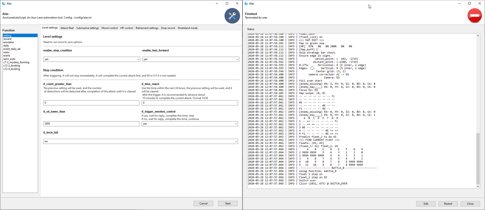

**| English | [Chinese](README.md) |**

# AzurLaneAutoScript

#### Discord [](https://discord.gg/AQN6GeJ) QQ Group 

Azur Lane bot with GUI (Supports CN, EN, JP, TW, able to support other servers), designed for 24/7 running scenes, can take over almost all Azur Lane gameplay. Azur Lane, as a mobile game, has entered the late stage of its life cycle. During the period from now to the server down, please reduce the time spent on the Azur Lane and leave everything to Alas.

Alas is a free open source software, link: https://github.com/LmeSzinc/AzurLaneAutoScript

EN support, thanks **[@whoamikyo](https://github.com/whoamikyo)** and **[@nEEtdo0d](https://github.com/nEEtdo0d)**.

JP support, thanks **[@ferina8-14](https://github.com/ferina8-14)**, **[@noname94](https://github.com/noname94)** and **[@railzy](https://github.com/railzy)**.

TW support, thanks **[@Zorachristine](https://github.com/Zorachristine)** , some features might not work.

GUI development, thanks **[@18870](https://github.com/18870)** , say HURRAY.

    




## Features  

- **Farm**: Main chapter, events, raids, 1-1 affinity farming, 7-2 mystery farming, 12-2 medium leveling, 12-4 large leveling, gems farming.
- **Reward**: Commission, tactical class, research, dorm, meowfficer, guild, missions, shop, shipyard, gacha, data key.
- **Daily**: Daily mission, hard, exercise, SOS, event daily AB, event daily SP, raid daily, war archives.
- **Opsi**: Ash beacon assist, Opsi monthly explore, Opsi daily, obscured zones, meowfficer farming, abyssal zones, siren strongholds.

#### Highlighted Features

- **Mood Control**: Calculates mood consumption, keep exp bonus or prevent red faces.
- **Event Exploring**: Able to run without clear mode, also handles fleet moving limits and other event mechanism.
- **Seamless Reward**: Calculates the finish time of research, commission, etc. Receive reward and dispatch again when time reached.
- **Operation Siren**: Receive Opsi dailies, purchase port shops, do Opsi dailies, do meowfficer farming, purchase Akashi's shop, clear obscured zones every 30 min, clear abyssal and strongholds. ~~What the ... is the strategic search, like sh*t, compares to Alas.~~
- **Opsi Explore**: After Opsi monthly reset, re-explore all zones without special radar (5000 oil item)


## Installation [](https://github.com/LmeSzinc/AzurLaneAutoScript/releases)

Refers to [Installation tutorial](https://github.com/LmeSzinc/AzurLaneAutoScript/wiki/Installation_en), including easy-installer manual, use manual, manual installation tutorial, remote access manul.


## How to Report Bugs

Spend at least 5 minutes for thinking and preparing, before someone spend his/her 5 minutes to help you. Issues like "Why isn't running", "Why stuck here" will not be answered.

- Check [Frequently Asked Questions (FAQ)](https://github.com/LmeSzinc/AzurLaneAutoScript/wiki/FAQ_en_cn).
- Check updates of Alas, ensure it's the latest.
- Upload error logs under `log/error`, which include `log.txt` and recent screenshots. If it's an  unexpected behavior not an error, provide today's log under `log` and at least one screenshot.


## Known issues

- **Unable to handle network issues**
- **Low-end PCs might have issues**, Low-end PCs have a screenshot time cost over 1s, while middle-end costs about 0.5s, high-end costs about 0.3s.
- **Exercise may too late to quit when it's going to failed**
- **NemuPlayer does not support two-finger zoom out send from minitouch, unable to collect loves and coins in dorm**. NemuPlayer is not recommended.
- **Swipe may be treated as click if emulator stuck randomly**


## Alas Community Guidelines

See [#1416](https://github.com/LmeSzinc/AzurLaneAutoScript/issues/1416).


## Documents

[Map detection](https://github.com/LmeSzinc/AzurLaneAutoScript/wiki/perspective_en)

The core of an Azur Lane bot is map detection. If you simply use `Template matching` to search enemies, will encounter situation that mob enemies block the boss. Alas provide a better map detection method. In `module.map_detection`, you will be able to access full map data, like this.

```
2020-03-10 22:09:03.830 | INFO |    A  B  C  D  E  F  G  H
2020-03-10 22:09:03.830 | INFO | 1 -- ++ 2E -- -- -- -- --
2020-03-10 22:09:03.830 | INFO | 2 -- ++ ++ MY -- -- 2E --
2020-03-10 22:09:03.830 | INFO | 3 == -- FL -- -- -- 2E MY
2020-03-10 22:09:03.830 | INFO | 4 -- == -- -- -- -- ++ ++
2020-03-10 22:09:03.830 | INFO | 5 -- -- -- 2E -- 2E ++ ++
```

Development documents, refer to [WIKI](https://github.com/LmeSzinc/AzurLaneAutoScript/wiki).


## Join Development

We will occasionally publish future work on [Issues](https://github.com/LmeSzinc/AzurLaneAutoScript/issues) and mark it as `help wanted`, feel free to submit [Pull Requests](https://github.com.com/LmeSzinc/AzurLaneAutoScript/pulls) to Alas, we will read every line of your code.

Oh yeah, don't forget to read the [development documentation](https://github.com/LmeSzinc/AzurLaneAutoScript/wiki/1.-Start).


## Relative Repositories

- [AzurStats](https://azur-stats.lyoko.io/), An Azur Lane drop statistics platform based on Alas.
- [AzurLaneUncensored](https://github.com/LmeSzinc/AzurLaneUncensored), [For CN only] Repository for uncensoring Azur Lane CN, connecting to Alas.
- [ALAuto](https://github.com/Egoistically/ALAuto), Another Azur Lane bot for EN, not maintaining anymore. Alas imitated its structure.
- [ALAuto homg_trans_beta](https://github.com/asd111333/ALAuto/tree/homg_trans_beta), Alas introduced its homography transition into map detection.
- [PyWebIO](https://github.com/pywebio/PyWebIO), GUI framework that Alas uses.

