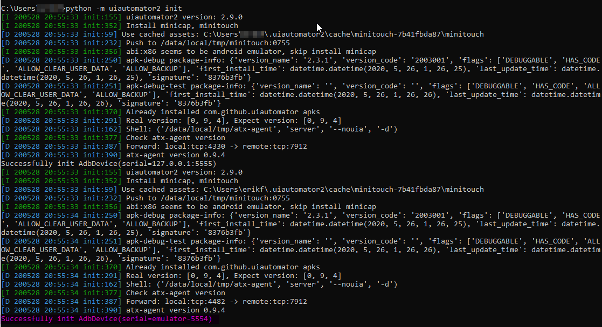
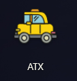
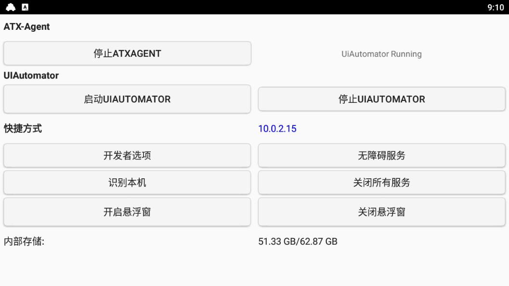

このドキュメントの翻訳は進行中です。
`2020/6/27 updated`

# AzurLaneAutoScript

Alas （アズールレーン自動化ツール / Azur Lane automation tool）
##### 本家はCNサーバー用でEN, JPサーバーにも対応しています。


## 目次
1. [JPサーバーへの対応](#about-jpport)
2. [特徴](#features)
3. [インストール方法](#how-to-install)
4. [使い方](#how-to-use)

<h2 id="about-jpport">JPサーバー(日本)への対応について</h2>

- **直近のイベントについて**: 「特別演習 超空強襲波」対応(2020/6/27)
- **JPサーバー用の画像について**: 画像は追加されていますが、一部CNサーバ用のものを使用しています。そのため、CN, ENサーバーで実行できる機能がJPサーバーで実行できない可能性があります。
- **翻訳について**: GUIやドキュメントは日本語に翻訳されていません。
- **委託機能について**: JPサーバー用の委託機能にはtesseractというOCRを用いています。委託機能を有効化したい場合にはtesseractを[別途インストール](#install-tesseract)してください。
- **CNOCRについて**: 委託機能以外の場所では中国語用のOCRであるCNOCRが使われており、日本語を認識できない可能性があります。
- **確認されている問題**:  
  - CNOCRについて

<h2 id="features">特徴</h2>

#### 以下は日本サーバー未対応のものも含まれます。上記参照

- **Campaign**: 通常海域に対応しています。実行できるマップは`./campaign`フォルダ内で確認することができます。  

- **Events**: イベント海域に対応しています。 実行できるマップは`./campaign`フォルダ内で確認することができます。  
  > Support「Skybound Oratorio」, specifically map D1 and D3, supporting handling of 光之壁? (Fleet is unable to proceed into square that has 光之壁. Support 开荒)

- **Daily Mission**: デイリー出撃（潜水艦以外）、演習、自動撤退を実行できます。  

- **Events x3 PT**: イベント海域A1~B3を30分で実行できます。

- **Commissions**: 海域実行中20分ごとに、委託報酬、研究報酬、デイリーミッション報酬を受け取り、委託を行うことができます。  
  > Dispatch commision every 20 minutes during campaign, accept commission rewards, research rewards, and daily mission rewards.

- **Misc Features**  

  - 疲労度(気分)のコントロール: 疲労度が下がりすぎるのを防いだり、経験値を稼ぐために維持したりします。  
  - HPの監視: HPが低くなった際の撤退、前衛のHPコントロールを行います。  
  - 装備変更  
  - 定期的にスクリーンショットを保存  
  - 自動退役  
  - 艦船強化  
  - マップ攻略モード: 新しいマップにおいて星3でのクリアに挑戦できます。  


<h2 id="how-to-install">インストール方法</h2>

以下の2つの方法でインストールすることができます。  
※インストール方法をすべて読んでから質問などをしてください。  
※性能の悪いPCだとエミュレーターが正しく動作しない場合があります。  

1. 自動インストール(インストールに自信がない方向け)
2. 手動インストール  

### 1.自動インストール(インストールに自信がない方向け)
* [動画チュートリアル](https://www.youtube.com/watch?v=bp4kd8P1qT4)  
1. zipファイルをダウンロード [AzurLaneAutoScript.zip](https://github.com/whoamikyo/AzurLaneAutoScript/releases)
2. zipファイルをどこかに解凍してEasy_Install-V2.batを実行.インストーラーが必要なフォルダを作成します。
3. フォルダ名にスペースが入っている場所でインストーラを実行しないでください、動作しなくなります。
  

### 2.手動インストール

- 必要なもの
  - 良いPC
    - 性能の悪いPCだとエミュレーターが正しく動作しない場合があります。
  - [Python](https://www.python.org/ftp/python/3.7.6/python-3.7.6-amd64.exe)
    - 3.7.6 64bit を強く推奨（その他のバージョンだと動作しない可能性あり）
    - PATHに追加されていること
    - venvを使うことを強く推奨
  - [ADB](https://developer.android.com/studio/releases/platform-tools)
    - Latest
    - PATHに追加されていること
  - Android エミュレーター(Bluestacksでテスト済み)
    - ADBデバッグが有効になっていること
    - 画面サイズ 1280x720

1. **このレポジトリをクローン**
    > git clone または download zip
2. **[Python](https://www.python.org/ftp/python/3.7.6/python-3.7.6-amd64.exe)をインストール**
    1. 3.7.6 64bit を強く推奨（その他のバージョンだと動作しない可能性あり）
    2. PATHに追加する
3. **venvで仮想環境を作成する(venvでvirtual envを作ることを強く推奨)**
    1. `python -m venv path_to_your_folder\venv`
    2. アクティベート(cmdの場合)  
      `.\venv\Scripts\activate.bat`
4. **パッケージインストール(venv アクティベート後)**  
    1. `pip install -r requirements.txt`
5. **Android エミュレーターを用意**
    1. Bluestacksでテスト済み
    2. ADBデバッグが有効にする
    3. 画面サイズを1280x720にする
    4. アズレンをインストール  

        > その他のエミュレーターの平均実行時間  

        | Device     | Emulator Version | Android Version | ADB Screenshot | UIAutomator2 Screenshot | ADB Click | UIAutomator2 Click |
        | ---------- | ---------- | -------- | ------- | ------ | ------- | ------ |
        | NemuPlayer | 7.1.3      | 5.1.1    | 0.308   | 0.275  | 0.294   | 0.146  |
        | LDPlayer   | 3.83       | 5.1.1    | 0.329   | 0.313  | 0.291   | 0.146  |
        | NoxPlayer  | 6.6.0.0    | 5.1.1    | 0.339   | 0.313  | 0.505   | 0.141  |
        | MuMuPlayer | 2.3.1.0    | 6.0.1    | 0.368   | 0.701  | 0.358   | 0.148  |
        | Oneplus5   |            | 7.1.1    | 1.211   | 0.285  | 0.447   | 0.160  |

        > These are the common emulation setting that we have tested on, tested Platform Windows 10, I7-8700K, 1080ti, nvme SSD, emulator resolution 1280x720, Azur Lane 60FPS, tested on map 7-2, on average execute 100 commands in seconds.  

        > As screenshot recognition has a high requirement needed to run, AzurLaneAutoScript currently does not support mobile devices, you MUST use an emulator.  

6. **ADB Setup**
    1. [ADB](https://developer.android.com/studio/releases/platform-tools)をインストール
    2. PATHに追加し、以下のコマンドでインストールを確認  
    `adb devices`

7. **UIAutomator2のスタートアップ**
    - [UIAutomator2](https://github.com/openatx/uiautomator2)
      - uiautomator2はスクリーンショットとクリックを高速化する自動テストライブラリです。
      - スクリーンショットとクリックにはadbを使うこともできますが、u2より遅くなります。
        - パフォーマンスの向上のためにはADBをスクリーンショットに、u2をクリックに使用することを推奨します。（u2のスクショはADBより少し速い、CPUリソースは2倍多く消費する。一方クリックはu2がどちらにおいても良い。）

    - **スタートアップ**
      - `python -m uiautomator2 init`
      - インストールが完了すると出力は以下のようになります。
        - 

    - すべての接続されたデバイスに以下がダウンロードされます。  
    [uiautomator-server](https://github.com/openatx/android-uiautomator-server/releases) , [atx-agent](https://github.com/openatx/atx-agent), [minicap](https://github.com/openstf/minicap), [minitouch](https://github.com/openstf/minitouch)
    - デバイスがエミュレーターの場合、minicapのインストールはスキップされます。

    - **UIautomator2のインストールが成功したか確認する**

      \dev_tools\emulator_test.py line 31にあるserialを対応するものに変更し、プロジェクトルートから以下を実行する。
      `python -m dev_tools.emulator_test`

      The default serial for some emulators:  

        | Android Emulator | serial          |
        |------------------|-----------------|
        | NoxPlayer        | 127.0.0.1:62001 |
        | MuMuPlayer       | 127.0.0.1:7555  |
        | Bluestacks       | 127.0.0.1:5555  |
        | LDPlayer         | emulator-5554   |

    - エミュレータに新しいアプリがインストールされたことが確認できます。

        

    - アプリを開くと起動しているか確認できます。

        

8. <strong id="install-tesseract">Tesseractのインストール（オプション）</strong>
    - （委託機能を使わない場合は必要ありません）
    - Tesseract  
      [https://github.com/UB-Mannheim/tesseract/wiki](https://github.com/UB-Mannheim/tesseract/wiki)
    - 日本語用のデータファイルをインストールする
      - select components
        - additional script data => Japanese script
        - additional language data => Japanese
    - 環境変数を設定する
      - 環境変数Pathに追加: インストール先\Tesseract-OCR
      - 環境変数TESSDATA_PREFIXを新規作成: インストール先\Tesseract-OCR\tessdata  


<h2 id="how-to-use">使い方</h2>

1. 自動インストールの場合
    - 起動
      - alas.batをダブルクリック
2. 手動インストールの場合
    - 起動
      - cmd内でvenvをactivate
      - `python alas_jp.pyw`

    > - (Not Recommeneded) to run alas.pyw throught cmd even thought Alas is using [Gooey](https://github.com/chriskiehl/Gooey) a library that converts the command line to a GUI, Alas didnt have a method for running command line before using gooey. Alas was meant to be use with gooey, as such the command line function was create hastily. Therefore, using command line to run Alas will not be easy.  
    > - (Not Recommended) to modify the configuration file 'config'alas.ini' and relation function in 'alas.py'
    > - Multi-usage: copy alas.pyw, and rename, double-click run on it. The settings of template.ini are copied when the first run runs. The script runtime uses the ini profile of the same name.

## Known issue

Sort by frequency

- **GUI starts slowly, uiautomator2 starts slowly**
- **Unable to deal with network fluctuations** Reconnect popup window
- **The green face, yellow face and red face will be displayed** This is the BUG, Alas will restart the game every 2 hour to update the affections level.
- **Exercises may fail**
- **Screen swipe will not work in rare circumstances**

## Doc
[Map Perspective](doc/perspective.md)

`Map Perspective` is the core foundation of Azur scripts. If you simply use (Template Matching) to search for enemies, it is inevitable that in some rare cases, the BOSS will be blocked by mobs. `AzurLaneAutoScript` provides a better map recognition menthod in `module.map`, you will be able to get a more complete sea information such as:


```
2020-03-10 22:09:03.830 | INFO |    A  B  C  D  E  F  G  H
2020-03-10 22:09:03.830 | INFO | 1 -- ++ 2E -- -- -- -- --
2020-03-10 22:09:03.830 | INFO | 2 -- ++ ++ MY -- -- 2E --
2020-03-10 22:09:03.830 | INFO | 3 == -- FL -- -- -- 2E MY
2020-03-10 22:09:03.830 | INFO | 4 -- == -- -- -- -- ++ ++
2020-03-10 22:09:03.830 | INFO | 5 -- -- -- 2E -- 2E ++ ++
```


[Development](doc/development.md)
- How to add a button
- How to adapt to a new map
- How to support other server/language

## Reference

- (Not open source) http://asaiq2.lofter.com/

  Ready made Azur scripts that has high completetion rate. Refer to the main functions and settings.

- https://github.com/Egoistically/ALAuto

  (Archived) https://github.com/perryhuynh/azurlane-auto

  EN Server script, use to mimic server architect.
