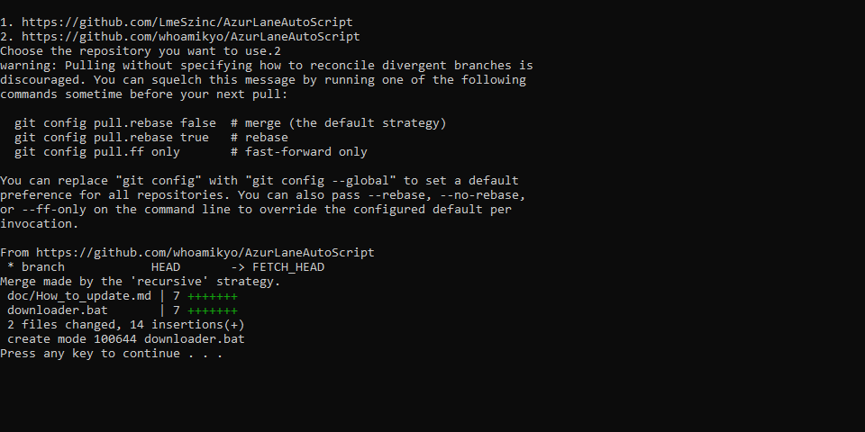

# How to use updater.bat

* This only will work if you have download the repository with GIT, if you downloaded the .zip you will have to delete the folder and download it again through GIT, see step 2.
* [Download and install the last GIT version](https://git-scm.com/download/win) (It is not necessary if you installed with Easy_Install-V2.bat)
* Open the file `Easy_Install-V2.bat` with any text editor
* Change the `C:\Program Files\Git\cmd` for the path that you are installed, you don't usually need to change it, but make sure it is installed in the same path as it is in the file., if you installed with `Easy_Install-V2.bat` it's probably all right and there's no need to do anything else
* It is important that the path you enter is the same as the one with the git.exe file as shown in the image.

    
* In `Easy_Install-V2.bat` we have 3 source options, I'm just going to tell you to use source 1 and only use another if someone tells you to do it or likes to test new adventures.

# How to Download repository through GIT

* Like above, you need GIT installed and make sure it is installed in the same path as it's in the file in the file `Easy_Install-V2.bat`.
* If you already download `AzurLaneAutoScript-master.zip`, just extract and double-click in `Easy_Install-V2.bat`, then the repository will be cloned again, but now the .git folder will be created.
* If you haven't downloaded the .zip, just download the `Easy_Install-V2.bat` file, create a folder where you want ALAS to be downloaded, put `dEasy_Install-V2.bat` inside that folder and click.

If you do it right, you will have a similar result, so only what has been changed will be downloaded again.

# DO NOT ADD FILES MANUALLY INSIDE THE ALAS FOLDER, THIS WILL CAUSE CONFLICTS AND YOU WILL HAVE TO DOWNLOAD EVERYTHING AGAIN.