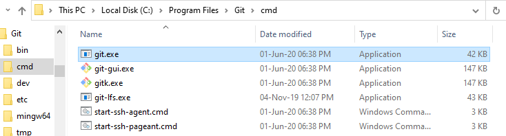

# How to use updater.bat

* [Download and install the last GIT version](https://git-scm.com/download/win)
* Open the file `updater.bat` with any text editor
* Change the `C:\Program Files\Git\cmd` for the path that you are installed, you don't usually need to change it, but make sure it is installed in the same path as it is in the file.
* It is important that the path you enter is the same as the one with the git.exe file as shown in the image.

    
* In `updater.bat` we have 2 source options, most of the time there will be no difference between them, if in doubt, choose option 1.
