# 傻瓜式安装教程

下面讲述如何使用傻瓜式安装包, 安装 Alas

1. **下载** 傻瓜式安装包

   点击 [这里](https://github.com/whoamikyo/AzurLaneAutoScript/releases) , 找到最新的傻瓜式安装包

   下载 `AzurLaneAutoScript.zip`, 不要下载 `Source code`.

   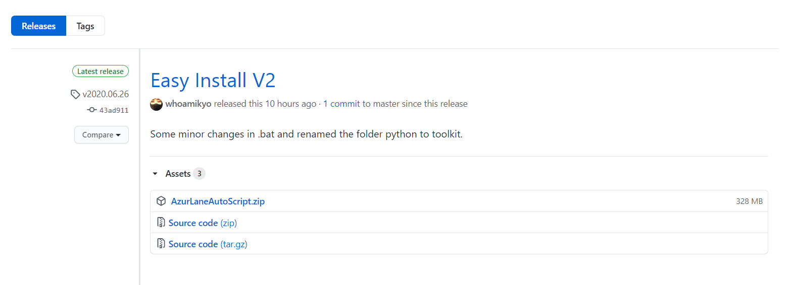

2. **解压** 解压到目录, 比如解压到 `D:\AzurLaneAutoScript`, 请确保有至少 1.5 GB 的空间.

   你会看到有一个名为 `toolkit` 的目录, 和一个名为 `Easy_Install-V2.bat` 的批处理文件

   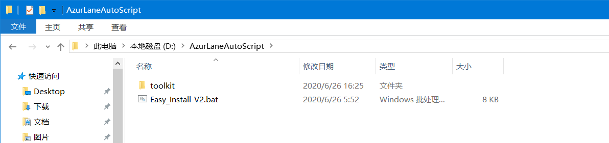

3. **右键 Easy_Install-V2.bat, 选择"以管理员身份运行"**

   当看到这些提示时, 说明已经获取到管理员权限, 按下回车键继续

   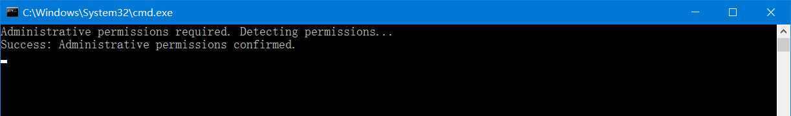

   这下面这个界面,  输入 `gitee` , 也就是从选择码云(gitee)镜像下载, 然后按下回车键

   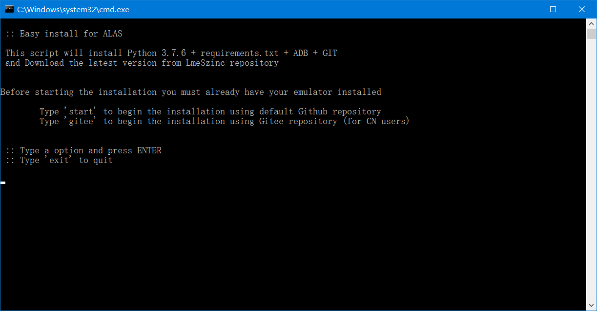

   当看到如下信息时, 说明安装成功

   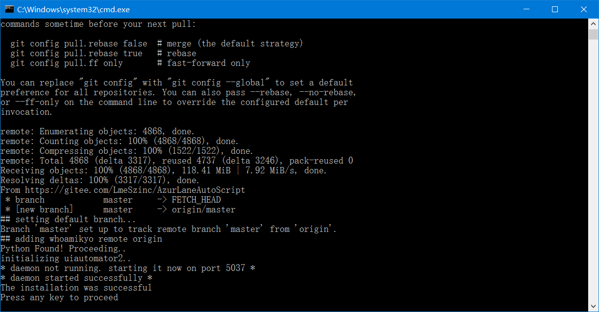

   再次按下回车, 就会回到标题界面

   然后你就可以关掉这个窗口了

4. **运行 alas.bat**

   在安装完成后, 你会看到刚才的目录下多出很多文件和文件夹

   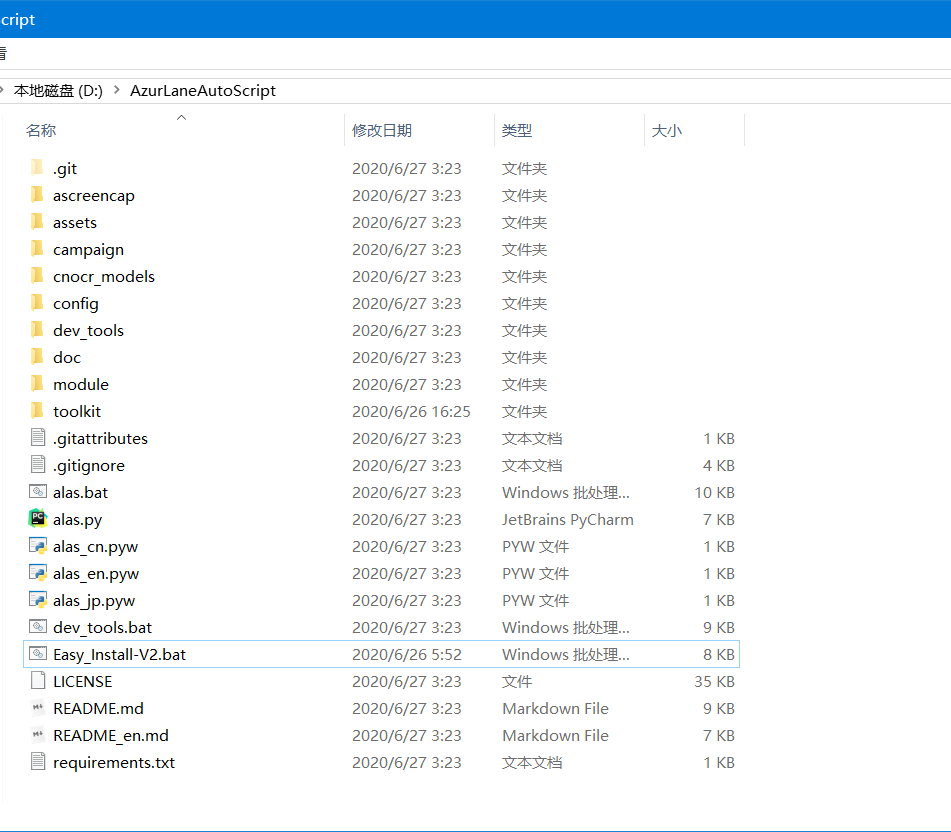

   现在右键点击 alas.bat, 选择 "**以管理员身份运行**"

   你将会看到一个黑色的命令行窗口

   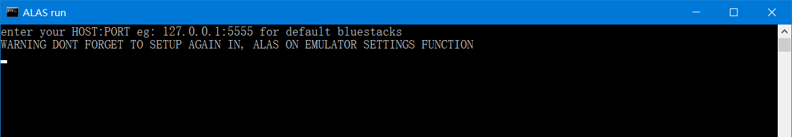

   在第一次运行的时候, 要求输入模拟器的SERIAL

   以下是一些常见模拟器的默认SERIAL. (如果你有多个模拟器实例, 它们的serial可能不是这里列出的)

   | 模拟器   | Emulator | serial          |
   | ---------- | ---------- | --------------- |
   | 蓝叠模拟器 | BlueStacks  | 127.0.0.1:5555 |
   | 夜神模拟器 | NoxPlayer  | 127.0.0.1:62001 |
   | MuMu模拟器 | MuMuPlayer | 127.0.0.1:7555  |
   | 逍遥模拟器 | MemuPlayer | 127.0.0.1:21503 |
   | 雷电模拟器 | LDPlayer   | emulator-5554   |

   输入完成后, 按下回车

   你会看到一些一闪而过的信息

   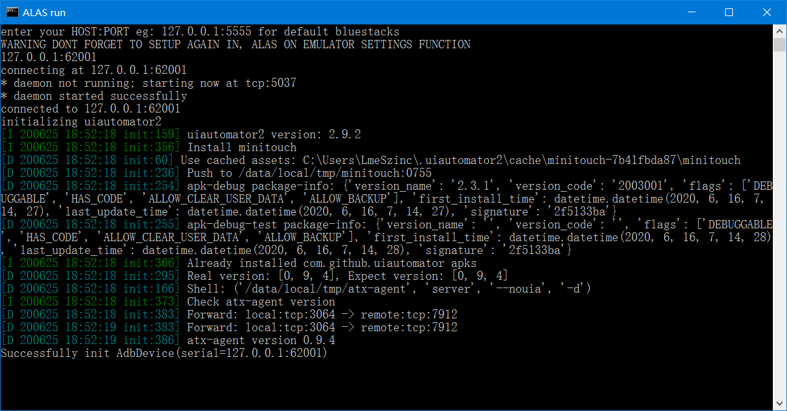

   接下来, 进入到主界面

   

   按下数字2, 也就是选择国服, 然后回车

   然后 Alas 的 GUI 就出来了

   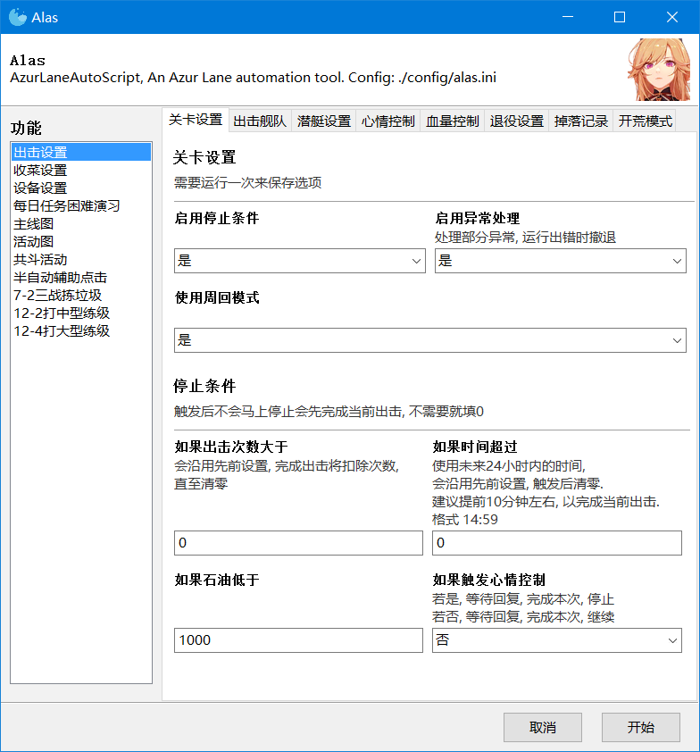
   
5. **检查模拟器连接**

   点击左侧菜单的 `设备设置`,

   - 把修改`设备`修改成刚刚使用的SERIAL.

   - 检查`包名`, `com.bilibili.azurlane` 是碧蓝航线B服的APK包名 (Package Name).

     如果你玩的是碧蓝航线B服, 不需要修改.

     如果你玩的是渠道服, 请自行搜索对应的APK包名并修改.

   - 点击`开始`, 这将保存选项并检查连接, 然后点击`编辑`返回主界面

   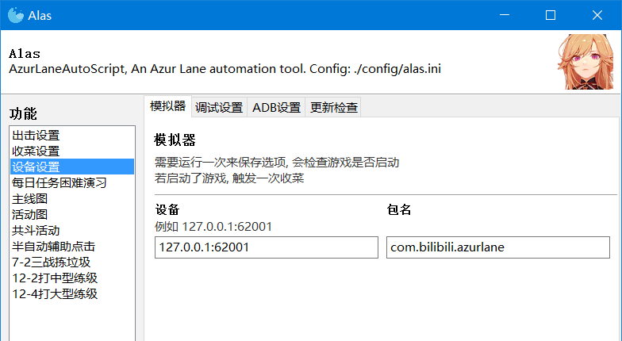

   当你看到以下信息时, 说明一切正常.

   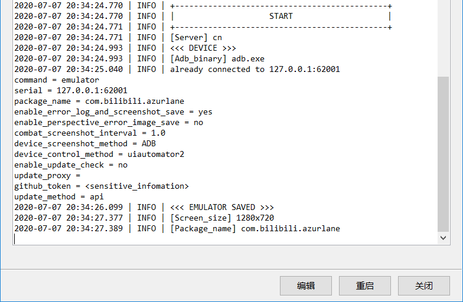

   现在可以点击`编辑`返回主界面, 开始使用Alas了.


# 傻瓜式更新教程

右键点击 alas.bat, 选择 "**以管理员身份运行**", 进入 Alas.bat 的主界面.


按下数字4, 也就是更新, 再按下回车键.

这里会询问更新的方式.

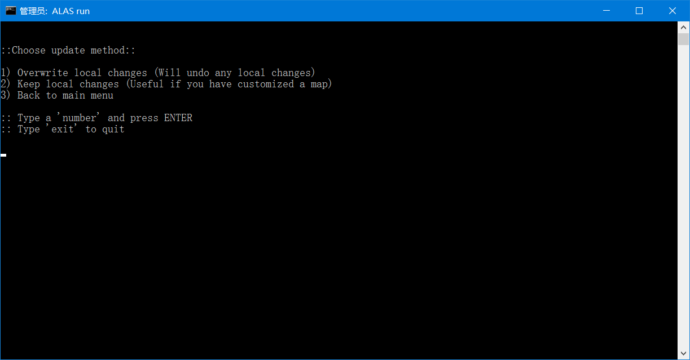

一般选 1 , 也就是覆盖已有文件(会保留用户设置). 如果你手动修改了一些文件, 比如编写了自己的地图逻辑, 并且希望保留, 就选 2.

输入选择的数字, 然后按下回车键.

进入到选择界面

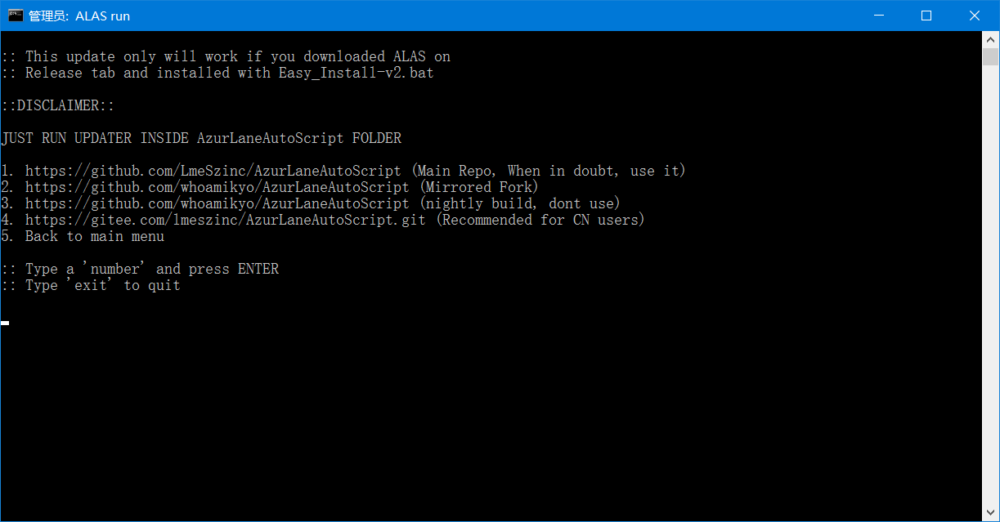

输入数字4, 选择从gitee镜像更新. 如果 Alas 有大版本更新需要更新, 就输入数字 5, 更新运行环境.

然后按下回车键

看到以下信息时, 说明更新完成

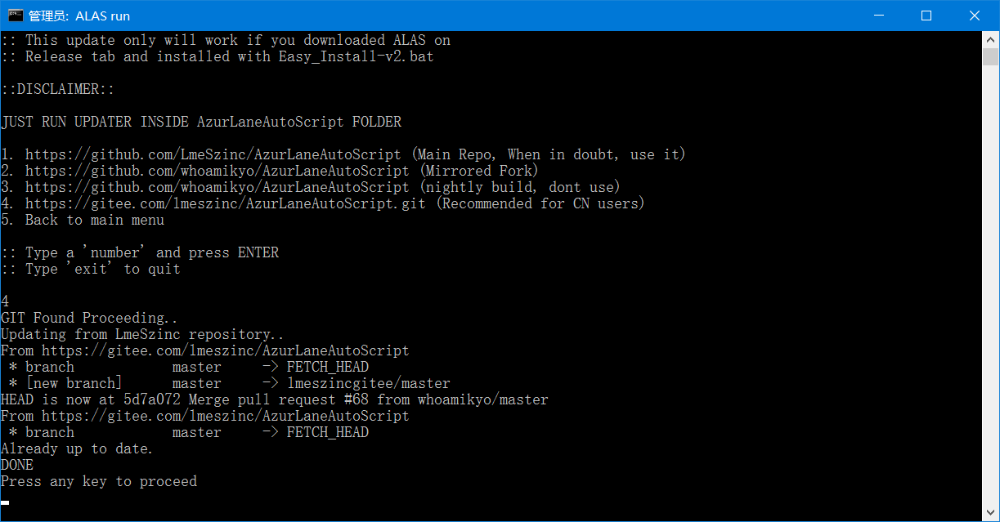

再次按下回车, 就会回到标题界面

然后你就可以关掉这个窗口了


# 高级用户安装教程

> 这里的高级用户, 指对python有一定了解, 能使用搜索引擎独立解决问题的人.

> 傻瓜式安装包里有什么?
>
> [WinPython](https://winpython.github.io/) Winpython64-3.7.6.0dot
>
> 预安装的依赖
>
> [PortableGit](https://git-scm.com/download/win)
>
> Easy_Install-V2.bat, 用来执行 git pull

- Clone 本项目

### 创建虚拟环境

虚拟环境中的 python 版本必须为 3.7.6

激活虚拟环境, 并安装依赖

```
pip install -r requirements.txt
```

> 如果在安装 Python-Levenshtein 的时候遇到 Microsoft Visual C++ 14.0 is required, 可以在[这里](https://www.lfd.uci.edu/~gohlke/pythonlibs/)下载它的 wheel 文件, 然后用 pip 安装
>
> ```
> pip install python_Levenshtein-0.12.0-cp37-cp37m-win_amd64.whl
> ```

### 安装模拟器

| 设备       | Device     | 模拟器版本 | 安卓版本 | adb截图 | u2截图 | adb点击 | u2点击 |
| ---------- | ---------- | ---------- | -------- | ------- | ------ | ------- | ------ |
| 逍遥模拟器 | MemuPlayer | 7.1.3      | 5.1.1    | 0.308   | 0.275  | 0.294   | 0.146  |
| 雷电模拟器 | LDPlayer   | 3.83       | 5.1.1    | 0.329   | 0.313  | 0.291   | 0.146  |
| 夜神模拟器 | NoxPlayer  | 6.6.0.0    | 5.1.1    | 0.339   | 0.313  | 0.505   | 0.141  |
| MuMu模拟器 | MuMuPlayer | 2.3.1.0    | 6.0.1    | 0.368   | 0.701  | 0.358   | 0.148  |
| 一加5      | Oneplus5   |            | 7.1.1    | 1.211   | 0.285  | 0.447   | 0.160  |

这里给出了一些常见模拟器的性能测试结果, 测试平台 Windows 10, I7-8700k, 1080ti, nvme SSD, 模拟器分辨率1280x720, 碧蓝航线 60帧开启, 进入地图 7-2, 执行100次取平均, 单位秒.

2020.06, 对 [aScreenCap](https://github.com/ClnViewer/Android-fast-screen-capture) 和 蓝叠模拟器(BlueStacks) 追加测试.

| 设备             | Device          | 模拟器版本   | 安卓版本 | aScreenCap截图 | adb截图 | u2截图 | adb点击 | u2点击 |
| ---------------- | --------------- | ------------ | -------- | -------------- | ------- | ------ | ------- | ------ |
| 夜神模拟器       | NoxPlayer       | 6.6.0.0      | 5.1.1    | 0.242          | 0.408   | 0.368  | 0.532   | 0.142  |
| 蓝叠模拟器(台湾) | BlueStacks (TW) | 4.205.0.1006 | 5.1.1    | 0.129          | 0.280   | 0.458  | 0.234   | 0.151  |

>  **结论**
>
>  推荐使用 蓝叠模拟器国际版
>
>  推荐使用 aScreenCap 截图, uiautomator2点击

> 由于海图识别模块对截图质量有很高的要求, `AzurLaneAutoScript` 暂时不支持手机, 必须使用模拟器. (Alas其实是支持手机的, 远古版本的Alas也是在手机上测试的, 但是长时间运行会发热和假死, 就放弃了)

- 安装一款安卓模拟器
- 模拟器分辨率设置为 `1280x720` .

### 配置ADB

- 获取 [ADB](https://developer.android.com/studio/releases/platform-tools)

- 将ADB配置于系统的环境变量中, 并测试是否配置成功.

```
adb devices
```

### 安装 uiautomator2

> [uiautomator2](https://github.com/openatx/uiautomator2), 是一个自动化测试的库, 可以加快截图和点击的速度.  `AzurLaneAutoScript` 也可以使用ADB来执行截图和点击, 就是慢一点而已. 

- 执行

```
python -m uiautomator2 init
```

  这会在所有连接的设备上安装 [uiautomator-server](https://github.com/openatx/android-uiautomator-server/releases) , [atx-agent](https://github.com/openatx/atx-agent), [minicap](https://github.com/openstf/minicap), [minitouch](https://github.com/openstf/minitouch) . 如果设备是模拟器, uiautomator2 将跳过 minicap 的安装.

- 检查 uiautomator2 是否安装成功

  修改 `module.dev_tools` 下的 `emulator_test.py` 中的 `SERIAL`, 并在虚拟环境下执行

  ```
  python -m dev_tools.emulator_test
  ```

  一些模拟器的默认 serial:

  如果你有多个模拟器, 需要执行 `adb devices` 查看对应的 serial
  
  | 设备       | Emulator   | serial          |
  | ---------- | ---------- | --------------- |
  | 蓝叠模拟器 | BlueStacks | 127.0.0.1:5555  |
  | 夜神模拟器 | NoxPlayer  | 127.0.0.1:62001 |
  | MuMu模拟器 | MuMuPlayer | 127.0.0.1:7555  |
  | 逍遥模拟器 | MemuPlayer | 127.0.0.1:21503 |
  | 雷电模拟器 | LDPlayer   | emulator-5554   |
  
  在运行时, 会打印当前截图方式的平均耗时和耗时标准差.
  
  打印几个之后, 就说明没问题, 你可以结束它.
  
  > **不同截图方式的差别**
  >
  > aScreenCap 远快于 uiautomator2 和 ADB. 但是cpu占用高, 在少部分模拟器上运行会报错.
  >
  > uiautomator2 在 VirtualBox 内核的模拟器上 (夜神模拟器, 逍遥模拟器, 雷电模拟器), 快于ADB, 但是在 BlueStacks 内核的模拟器上 (蓝叠模拟器, MuMu模拟器), 慢于 ADB.
  >
  > ADB 兼容性最好.
  >
  > Alas 默认使用 ADB 截图, 如果 aScreenCap 可用, 则推荐使用.
  
  > **不同点击方式的差别**
  >
  > uiautomator2 使用的 minitouch 在点击速度, 手势操作等方面碾压 ADB.
  >
  > Alas 默认使用 uiautomator2 点击, 也推荐使用 uiautomator2.

### 启动

- 快捷方式运行

  右键点击 `alas.pyw`, 创建快捷方式

  右键点击刚刚创建快捷方式, 点击`属性`, 将`目标` 更改为

  ```
  "<你的虚拟环境的绝对路径>\pythonw.exe" "<你的Alas安装目录的绝对路径>\alas_cn.pyw"
  ```

  点击 `确定`

  现在, 你可以把这个快捷方式移动到任意地方, 比如桌面

  > 这个启动方式是最好的, 不会像使用alas.bat那样出现命令行窗口, 双击即可运行
  >
  > 但是如果 GUI 启动中出现错误, 不会出现任何窗口, 也不会有任何报错信息

- 多开运行

  复制 alas.pyw, 并重命名. 首次运行时会复制template.ini的设置. 脚本运行时会使用同名的ini配置文件.

  比如, 将`alas.pyw`复制为`alas2.pyw`, 创建快捷方式运行, 在运行时就会使用`config\alas2.ini`

- 其他运行方式 (不推荐)

  - 通过命令行运行. 虽然alas使用了 [Gooey](https://github.com/chriskiehl/Gooey), 一个将命令行转为GUI的库, 但是Alas并不是先有命令行方法运行再用gooey的, Alas是为了使用gooey快速编写GUI而去拼凑命令行参数的. 因此使用命令行会很难受.
  - 修改配置文件 `config/alas.ini` , 在 `alas.py` 中调用相关函数