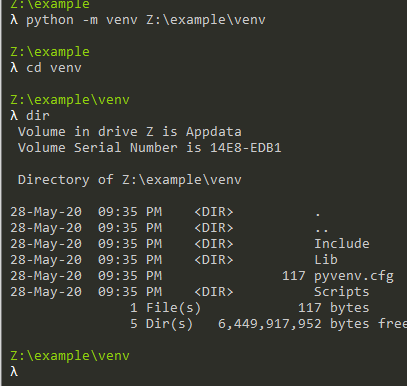
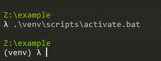
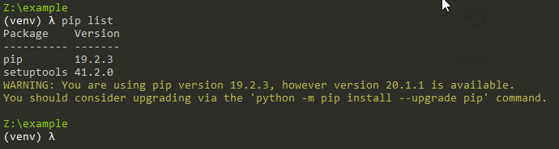
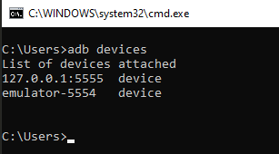
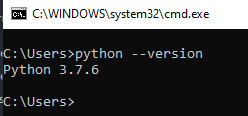
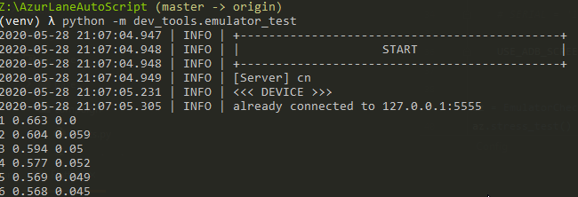

# Quick guide

#### Requirements

* A good PC (Potato PC may have problems running the emulator correctly)
* [Python](https://www.python.org/ftp/python/3.7.6/python-3.7.6-amd64.exe) installed and added to PATH (is highly recommended 3.7.6 64bit version only) 
* Latest [ADB](https://developer.android.com/studio/releases/platform-tools) added to PATH.
* [I don't know how to add to PATH](https://www.youtube.com/watch?v=Y2q_b4ugPWk)
* The use of a virtual environment (venv) in python is highly recommended
* ADB debugging enabled and emulator with 1280x720 resolution
* **Read the entire guide before asking any questions.**

# New automatic installation method (Recommended)

* Just download the file [Easy_Install-V2.bat](https://github.com/whoamikyo/AzurLaneAutoScript/releases), put in some folder and run as administrator (`Right click> Run as administrator`) 
* Do not install ALAS in a folder that contains spaces in the name, this will make the scripts not work correctly, created a folder at the root of some drive like `C:\ALAS\` or `D:\ALAS\`, Then place Easy_Install-V2.bat in that folder and run.
* Then it will install everything and download ALAS
* Will be created a folder `AzurLaneAutoScript` in the directory you run `Easy_Install-V2.bat`
* To Run ALAS, just click in `alas.bat`
* to avoid connection errors it's recommended to configure your emulator port correctly, in `alas.bat` first start will be prompt to enter your HOST:PORT, just open it with notepad and edit line 5, remove the `::` and configure with your emulator PORT, below you have more information on how to find your emulator PORT, READ ALL.
* It probably doesn't work on windows 7, you can test it and if it doesn't work try manual installation, tested on Windows 10 x64 Version 2004.

# Manual installation method

### How to create e python virtual environment

* First install [Python](https://www.python.org/ftp/python/3.7.6/python-3.7.6-amd64.exe)

* Create a folder where you will put the virtual environment, I recommend creating a folder `venv` in the project's root directory
* Go to project root in command line
* type `python -m venv path_to_your_folder\venv`

    
    
    You can see that now python has created some folders and files in the venv folder, it has created a completely clean virtual environment, thus preventing any conflicts.
* Now, it is necessary to activate the virtual environment in command line, go to project root (the same where you have the file alas.py) and type `.\venv\scripts\activate.bat`

   
   
   Look that a `(venv)`, with that we know that we are in a virtual environment.
   
   If you type `pip list` should get this output:
   
   

    Now, you can proceed with the installation of the requirements through `pip install -r requirements.txt`

#### Installation

* Clone this repository
* Install the requirements.txt (`pip install -r requirements.txt`)
* Install an android emulator (Tested on BlueStacks)
* The android emulator resolution must be set to `1280x720`

* Test if the ADB is working correctly `adb devices`
            
    The output must be something like this

    

    Test if your Python is working correctly `python --version`

    
    
* Install uiautomator2

uiautomator2, is an automated test library that can speed up screenshots and clicks. You can also use ADB to perform screenshots and clicks, but it is a slower way.

For performance optimization, it is recommended to use ADB screenshots, uiautomat2 screenshot slightly faster than adb screenshot, but cpu consumption double.

* Perform

    `python -m uiautomator2 init`
    
    The output must be something like this:
    
    
    (in this case, I had already installed)
    
* Check if uiautomator2 was installed successfully

Modify the `serial` in \dev_tools\emulator_test.py line 31 and, execute from root project directory (the same where you have the file alas.py)

`python -m dev_tools.emulator_test`

The output must be something like this:

The default `serial` for some emulators:

| Android Emulator | serial          |
|------------------|-----------------|
| NoxPlayer        | 127.0.0.1:62001 |
| MuMuPlayer       | 127.0.0.1:7555  |
| Bluestacks       | 127.0.0.1:5555  |
| LDPlayer         | emulator-5554   |

You can check a new app installed in your emulator:

If you open up can check if are running:

If are not running, you cannot use U2 and will get error.

## How to use Use

If you installed with `Easy_Install-V2.bat` you can just double-click alas.bat, if not you can call `py alas_en.pyw` from command line to open the GUI

Multi-usage: copy alas.pyw, and rename, double-click run on it. The settings of template.ini are copied when the first run runs. The script runtime uses the ini profile of the same name.

    

    
    