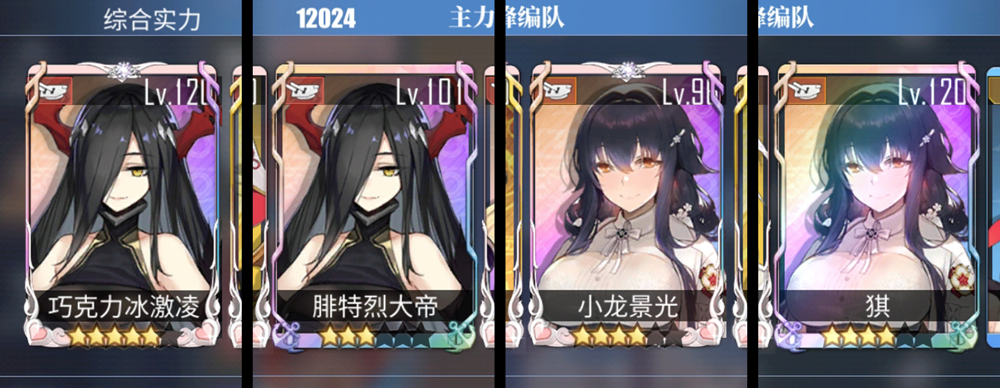
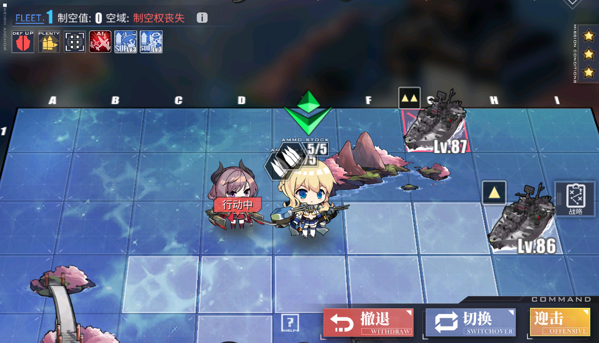
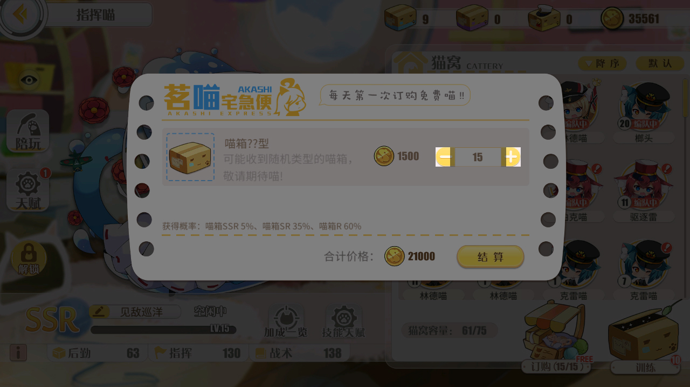
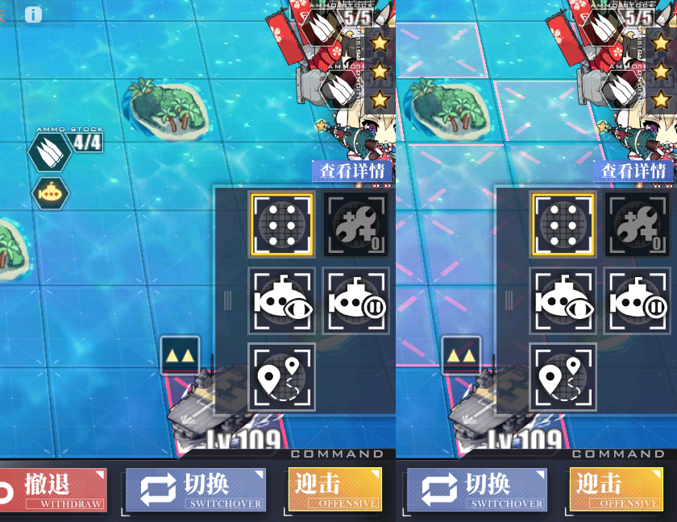

# Bugs in AzurLane

In CN, people found so many bugs in AzurLane.

Here list the bugs which are found by Alas or have negative effects on Alas.

## Mood update bug

> Appear time: Since game Launched
>
> Found time: Long time ago
>
> Fixed time: Not yet

AzurLane server and Alas calculate mood correctly, but the game don't.

After a long run, you will see red face in game, but actually is in high morale

So need to restart the game to update mood from server.

Detailed explanation (In Chinese), [here](https://www.bilibili.com/read/cv5088868)

> **心情与后宅大讲堂系统讲解和奇怪操作**
>
> **Strange things in dorm, lecture hall and mood**
>
> 瓜游的很多数据并不是在本地运算的，你每个舰娘实际的心情都是存在服务器里的，并且只有在你重新登录游戏的时候才会刷新本地数据。。。而你出击能否获取额外经验和加不加好感度实际上也是服务器端决定的，本地数据只是让你看看的而已，表面上这其实没啥问题，毕竟瓜游心情机制其实属于一个很傻瓜的算法，所以确实也没必要每次出击都重新获取一次数据。
>
> 但是问题来了，你本地端的算法里认为后宅2楼和后宅1楼的心情回复是相同的。而服务器端认为2楼相对于1楼有额外10点每小时的心情回复。这就导致你后宅2楼的舰娘每小时实际心情都会比本地端显示的高10点，（有人提到本地端单次回复的心情值没问题，可能这个bug的表现形式单纯的只是漏回复了心情）举个极端例子，你连续以一个正好的速度带着2楼舰娘恒定肝15个小时，期间始终没有重启游戏，那么你本地端会显示你2楼舰娘心情为0，并且会提示你心情0出击会扣好感，但是实际上服务器端里你舰娘的心情是满值的150点，即使你强制出击也不会扣好感度，因为决定好感度增减与否也是服务器端决定的，而服务器端里的心情是150，自然不会扣好感。
>
> 怎么解决这个问题呢，目前只有1个办法，重启游戏。这样才会重新获取一次心情数据。
>
> 总之2楼舰娘你保持每小时出击25次以内，也就是每2.4分钟才出击一次就能始终保持20%心情buff，如果是婚舰那就是每2分钟出击1次。你实在觉得那个错位的心情提示很难受的话没事重启一下游戏就好了。

## Commission list refresh bug

> Appear time: Since game Launched
>
> Found time: Long time ago
>
> Fixed time: Not yet

If you don't restart the game and receive a commission in new day, the extra daily commission will be preserved, these commissions are time-wasting and low cost-effective.

This is a bug in game, and if you make good use that, can turn out to be a feature.

## Level number position bug on married PRY ship

> Appear time: Since New-UI launched
>
> Found time: 2019.07
>
> Fixed time: 2019.11

I found this, because the OCR for the level of exercises opponents don't work well.

> 未婚金科研, 已婚金科研, 未婚彩科研, 都不会挡.
> 已婚彩科研会挡.
> (截图均来自演习对手, 船坞, 经验结算, 都会出现遮挡)
>
> 搜了一下, 2019-07-03 1661楼提过这个问题了, 两个月过去了, 并没有解决....

## Fleet ammo icon position bug

> Appear time: Unknown
>
> Found time: 2020.04.29, CN event 复刻苍红的回响
>
> Fixed time: Not yet, may be a feature

When fleet get caught by siren, the fleet ammo icon goes to the right.

> 被精英抓住后, 弹药图标会漂移到右边

## Cats buying button bug

> Appear time: Unknown
>
> Found time: 2020.05.05
>
> Fixed time: Not yet

When adding cats, only clicking the high-lighted area is valid.

> 指挥喵购买界面的加减按钮, 实际范围比显示的要小, 经常点半天没反应
> 只有点图中高亮的范围才有效

## Submarine zone icon bug

> Appear time: 2020.05.21, since CN event 穹顶下的圣咏曲
>
> Found time: 2020.05.29
>
> Fixed time: Not yet

When switching the submarine zone, the icon in the strategy don't change.

> 显示或隐藏潜艇狩猎范围, 图标都不会改变

