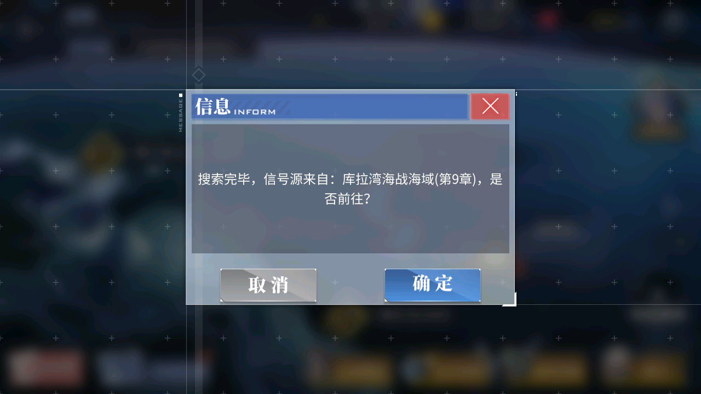

# 参与开发 Development

- [如何添加一个按钮 How to add a button](#如何添加一个按钮 How to add a button)
- [如何适配一张新的地图 How to adapt to a new map](#如何适配一张新的地图 How to adapt to a new map)

## 如何添加一个按钮 How to add a button

按钮文件按模块保存于 `./asset` 目录下, 按钮定义于每个模块的 `asset.py` 文件中.

比如 `BATTLE_PREPARATION` 按钮文件是这样的


在 `asset.py` 它是这样的

```
BATTLE_PREPARATION = Button(area=(1043, 607, 1241, 667), color=(234, 179, 97), button=(1043, 607, 1241, 667), file='./assets/combat/BATTLE_PREPARATION.png')
```

注意, 所有的 `asset.py` 都是由 `./dev_tools/button_extract.py` 生成的, 不要手动去修改. 手动填写按钮的四角坐标是一件非常痛苦的事, 特别是当有大量的按钮或者按钮需要频繁修改的时候.

假设我们希望添加一个 `确定` 按钮, 它出现于潜艇信号扫描时.

1. **截图**

   

2. **将图片复制到./asset下相应的目录中**, 更改文件名, 比如 `SEARCH_CONFIRM.png`

3. **拖动至Photoshop中**, 这里以 Photoshop CS6 为例

4. **使用选区工具框选按钮区域**

5. **播放动作**

   第一次操作时, 可以按照以下步骤添加动作.

   在菜单栏的 `窗口` 中, 点击 `动作` , 弹出动作窗口

   在添加动作之前, 最好备份当前图片, 因为接下来需要记录的操作是不可逆的.

   - 在动作窗口中, 点击新建动作的图标, 按照自己的喜好命名, 比如 `button_image`. 点击 `记录` , 注意灰色的圆圈变红了, 这表示动作录制开始了
   - 在图片区域单击鼠标右键, 点击 `选择反向` 
   - 在菜单栏的 `编辑` 中, 点击 `填充` 
   - 在弹出的填充选项窗口中, 填充内容使用 `黑色` , 填充模式选择 `正常`, 不透明度选择 `100`, 点击 `确定`
   - 在菜单栏的 `文件` 中, 点击 `保存`
   - 在菜单栏的 `文件` 中, 点击 `关闭`
   - 在动作窗口中, 单击停止录制的图标, 此时动作录制停止

   录制完成后, 会得到动作如下

   ```
   button_image
       反向
       填充
       	使用:黑色
       	不透明度:100%
       	模式:正常
       储存
       关闭
   ```

   在以后的添加按钮的时候, 就可以直接点击 播放动作 的按钮, 完成图片处理

6. **(可选) 添加属性覆盖图片**

   一个按钮具有三个属性:

   - area, 按钮识别的区域
   - color, 按钮的颜色
   - button, 按钮出现后的点击区域

   假如添在同一目录下放置图片文件 `SEARCH_CONFIRM.BUTTON.png` , 并按照刚才描述的方法处理图片. 那么这张图片的 `button` 属性将覆盖  `SEARCH_CONFIRM.png` 的 `button` 属性.

   这是一个非常有用的特性, 因为脚本通常需要判断截图中出现的元素, 然后点击按钮, 需要判断的地方和需要点击的地方可能不出于同一位置.

7. **运行./dev_tools下的button_extract.py**

   button_extract.py会自动提取按钮的属性, 免去了人工输入的烦恼

   ```
   python -m dev_tools.button_extract
   ```

8. **使用按钮**

   继承 module.base.base 下的 ModuleBase 类, 可以调用以下方法:

   - appear()
   - appear_then_click()
   - wait_until_appear()
   - wait_until_appear_then_click()
   - wait_until_disappear()
   
   方法的可选参数:
   
   - offset (bool, int, tuple): 默认为0, 为0时将使用按钮在截图上的平均颜色识别按钮
   
     输入后, 表示按钮参照预设的区域偏移的范围, 此时使用模板匹配识别按钮
   
   - interval (int): 按钮的触发间隔, 默认为0.
   
     代表按钮的触发间隔, 当按钮点击后有动画时, 这个参数可以防止按钮被频繁地点击.
   
   - screenshot (bool): 按钮出现后保存截图
   
   - genre (str): 截图保存的子目录名称


## 如何适配一张新的地图 How to adapt to a new map

下面举例适配 7-2 的简单版, 完整逻辑在 campaign.campaign_main.campaign_7_2

### 定义地图

1. **新建**

   在 `./campaign` 下新建目录, 如果是新的活动图, 建议按照 `event_<活动时间>_<服务器>` 命名目录, 比如 event_20200326_cn.

   新建 .py 文件, 文件名称为地图名, 小写, 以字母开头, 比如sp3, d3.

2. **导入**

   ```
   from module.campaign.campaign_base import CampaignBase
   from module.map.map_base import CampaignMap
   ```

3. ```
   MAP = CampaignMap()
   ```

4. **(可选) 设置地图大小**

   不填时, 根据海域信息生成

   ```
   MAP.shape = 'H5'
   ```

5. **设置海域信息**

   在 `碧蓝航线WIKI` 中查看敌人刷新信息, 如果是新地图, WIKI可能需要一两天的时间更新.

   

   ```
   MAP.map_data = '''
       ME ++ ME -- ME ME -- SP
       MM ++ ++ MM -- -- ME --
       ME -- ME MB ME -- ME MM
       -- ME -- MM -- ME ++ ++
       SP -- ME ME -- ME ++ ++
   '''
   ```

   地图信息最少要包含海陆位置, 识别海陆现在还有一些困难

   如果出生点比较偏僻的话, 还应包括出生点

   ```
   MAP.map_data = '''
       -- ++ ++ -- -- -- -- SP
       -- ++ -- -- -- -- -- --
       -- -- -- -- -- -- -- --
       -- -- -- -- -- -- ++ ++
       SP -- -- -- -- -- ++ ++
   '''
   ```

   关于这些符号的含义, 在 module.map.grid_info.py 中.

| print_name | property_name  | description             |
|------------|----------------|-------------------------|
| ++         | is_land        | fleet can't go to land  |
| --         | is_sea         | sea                     |
| __         |                | submarine spawn point   |
| SP         | is_spawn_point | fleet may spawns here   |
| ME         | may_enemy      | enemy may spawns here   |
| MB         | may_boss       | boss may spawns here    |
| MM         | may_mystery    | mystery may spawns here |
| MA         | may_ammo       | fleet can get ammo here |
| MS         | may_siren      | Siren/Elite enemy spawn |

6. **(可选) 设置海域权重**

   越高的数值表示越不希望舰队前往. 不设置时, 全部为10.

   ```
   MAP.weight_data = '''
       40 30 30 30 30 30 30 30
       20 20 20 20 20 20 20 20
       10 10 10 10 10 10 10 10
       20 20 20 20 20 20 20 20
       30 30 30 30 30 30 30 30
   '''
   ```

7. **(可选) 设置相机位置**

   ```
   MAP.camera_data = ['D3']
   ```

   不设置时, 会根据地图大小和相机视野生成.

   手动设置可以加快地图扫描的速度, 比如在 7-2 中, 自动生成的相机位置是 D2 D3 E2 E3, 实际上只需要将相机对准D3就可以看到整个地图(A1就不管了).

8. **(可选) 设置敌人刷新信息**

   ```
   MAP.spawn_data = [
       {'battle': 0, 'enemy': 3},
       {'battle': 1, 'enemy': 2, 'mystery': 1},
       {'battle': 2, 'enemy': 2, 'mystery': 1},
       {'battle': 3, 'enemy': 1, 'mystery': 2},
       {'battle': 4, 'enemy': 1},
       {'battle': 5, 'boss': 1},
   ]
   ```
   
   这里记录了每一战过后会刷新一些什么, 这个信息在 WIKI 上没有, 需要手动收集.
   
   理论上, 不填写也可以运行. 敌人刷新信息的作用是纠正识别错误和缺失, 还有就是捕捉BOSS刷新时的相机移动
   
9. **展开地图**

   ```
   A1, B1, C1, D1, E1, F1, G1, H1, \
   A2, B2, C2, D2, E2, F2, G2, H2, \
   A3, B3, C3, D3, E3, F3, G3, H3, \
   A4, B4, C4, D4, E4, F4, G4, H4, \
   A5, B5, C5, D5, E5, F5, G5, H5, \
       = MAP.flatten()
   ```

   这是为后续编写索敌逻辑做的准备, 可以使用以下代码生成

   ```
   shape = 'H5'
   def location2node(location):
       return chr(location[0] + 64 + 1) + str(location[1] + 1)
   def node2location(node):
       return ord(node[0]) % 32 - 1, int(node[1]) - 1
   shape = node2location(shape.upper())
   for y in range(shape[1]+1):
       text = ', '.join([location2node((x, y)) for x in range(shape[0]+1)]) + ', \\'
       print(text)
   print('    = MAP.flatten()')
   ```

10. **(可选) 定义地图元素**

    比如定义路障

    ```
    ROAD_MAIN = RoadGrids([A3, [C3, B4, C5], [F1, G2, G3]])
    ```


### 设置地图参数

地图参数将覆盖默认参数和用户参数, 具有最高优先.

如何不知道如何设置, 跳过即可. 但需要有定义.

```
class Config:
    pass
```

可以设置的属性参照 module.config.config

比如, 对于微层混合D3, 因为地图加入了海雾, 需要不同的网格识别参数(默认参数是针对7-2的).

```
class Config:
    INTERNAL_LINES_FIND_PEAKS_PARAMETERS = {
        'height': (100, 220),
        'width': 1,
        'prominence': 10,
        'distance': 35,
    }
    EDGE_LINES_FIND_PEAKS_PARAMETERS = {
        'height': (255 - 80, 255),
        'prominence': 2,
        'distance': 50,
        'wlen': 1000
    }
```

对于活动图应该有以下设置, 开启精英识别.

```
class Config:
	MAP_HAS_AMBUSH = False
    MAP_HAS_FLEET_STEP = True
    MAP_HAS_MOVABLE_ENEMY = True
    MAP_HAS_SIREN = True
    MAP_HAS_DYNAMIC_RED_BORDER = True
    MAP_SIREN_COUNT = 2
```

如果前面仅输入了最少的海域信息, 或者没有敌人刷新信息, 应注明地图信息缺失, 此时会以开荒模式运行

```
class Config:
	POOR_MAP_DATA = True
```

对于国服复刻苍红的回响, 抬高了相机位置, 网格缩小到0.66倍, 应该有

```
class Config:
	MAP_GRID_CENTER_TOLERANCE = 0.3

	INTERNAL_LINES_HOUGHLINES_THRESHOLD = 50
    EDGE_LINES_HOUGHLINES_THRESHOLD = 50
    CAMERA_SWIPE_MULTIPLY_X = 200 * 0.7
    CAMERA_SWIPE_MULTIPLY_Y = 140 * 0.7
    COINCIDENT_POINT_ENCOURAGE_DISTANCE = 1.
    MID_DIFF_RANGE_H = (45, 70)
    MID_DIFF_RANGE_V = (97 - 3, 97 + 3)
    TRUST_EDGE_LINES = True

    VANISH_POINT_RANGE = ((540, 740), (-4000, -2000))
    DISTANCE_POINT_X_RANGE = ((-2000, -1000),)
    INTERNAL_LINES_FIND_PEAKS_PARAMETERS = {
        'height': (80, 255 - 40),
        'width': (0.9, 10),
        'prominence': 10,
        'distance': 35,
        'wlen': 100,
    }
    EDGE_LINES_FIND_PEAKS_PARAMETERS = {
        'height': (255 - 40, 255),
        'prominence': 10,
        'distance': 50,
        'wlen': 1000
    }
```


### 编写索敌逻辑

- 可以不写, 全默认

    ```
    class Campaign(CampaignBase):
        MAP = MAP
    ```

- 简单的逻辑

  按照第几战编写逻辑, 缺失时, 使用上一战的逻辑

  一般而言, 每一战的逻辑应该以拣问号和清除路障开始, 再清除潜在的路障, 最后返回默认战斗逻辑

  ```
  class Campaign(CampaignBase):
      MAP = MAP
  
      def battle_0(self):
      	self.clear_all_mystery(nearby=False)
          if self.clear_roadblocks([ROAD_MAIN], strongest=True):
              return True
          if self.clear_potential_roadblocks([ROAD_MAIN], strongest=True):
              return True
          if self.clear_enemy(strongest=True, weight=True):
              return True
  
          return self.battle_default()
  
      def battle_5(self):
          self.clear_all_mystery(nearby=False)
          if self.clear_roadblocks([ROAD_MAIN]):
              return True
  
          return self.fleet_2.brute_clear_boss()
  ```

  

未完待续


## 如何支持其他服务器/语言 How to support other server/language

### GUI

Copy `./module/config/argparser.py` to `argparser_xx.py` and change the argment.

Create a dictionary in `./module/config/dictionary.py` that translate your language to english.

Copy `alas_cn.py` to `alas_xx.py` and import  `argparser_xx.py` . Then, edit server name.

> Format of .pyw file name: <sctipt_name>_<server_name>.pyw
>
> Script name is used to load ini file under `./config`, For example, alas_cn.pyw and alas_en.pyw both loads `./config/alas.ini`, but in different languages.

### Assets

Copy folder `./assets/cn` to `./assets/<your server>`, and replace the image. This will cost a lot of time to find, crop and test. Fortunately, if a image does not contain any charactors, it may works in all servers.

After replacing an image, don't forget to run `./dev_tools/button_extract.py`

### Class methods

Some method may be different in different servers. This decoractor is use to calls different function with a same name according to config (AzurLaneConfig instance).

```
from module.base.decorator import Config
from module.base.base import ModuleBase

class AnotherModule(ModuleBase):
    @Config.when(SERVER='en')
    def function(self):
        # This method will be called only in EN server
        pass

    @Config.when(SERVER=None)
    def function(self):
        # This method will be called in other server
        pass
```

### Other

There area also some modules diffcult to change: the commission module.

In `./module/reward/commission.py`, I use [cnocr](https://github.com/breezedeus/cnocr) to recognize commission name in chinese, it may not works well in other languages.

