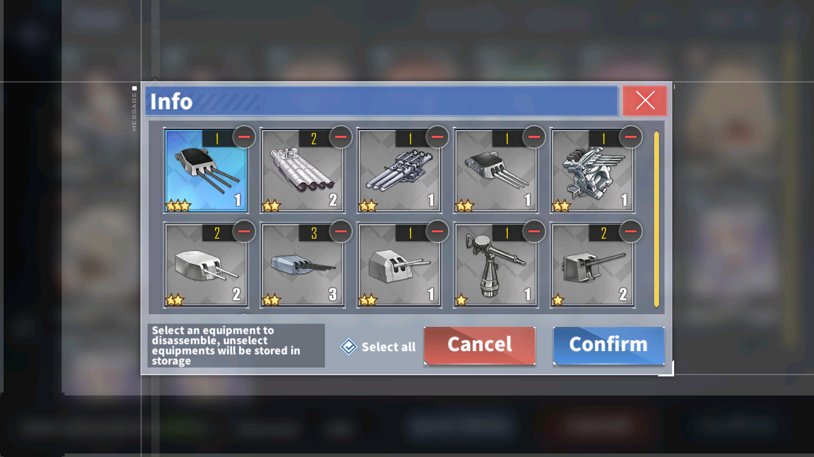
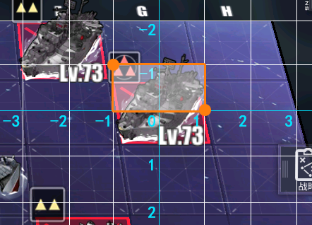
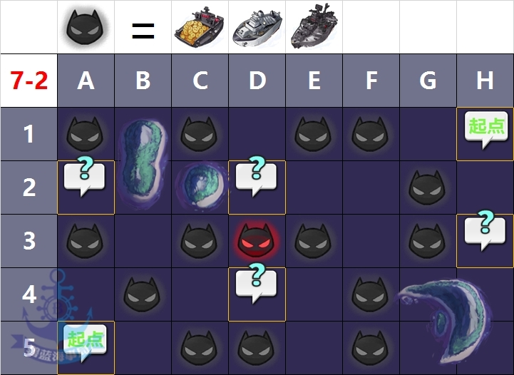

**Translation under progress**

# Participate in development

- How to add a button
- How to adapt to a new map
- How to support other server/language

## How to add a asset

Assets are stored in `./asset` directory, and is defined in each module `asset.py` file.

For example, the button `BATTLE_PREPARATION`


In `asset.py` it is this:

```
BATTLE_PREPARATION = Button(area={'cn': (1043, 607, 1241, 667), 'en': (1045, 607, 1241, 667)}, color={'cn': (234, 179, 97), 'en': (235, 182, 102)}, button={'cn': (1043, 607, 1241, 667), 'en': (1045, 607, 1241, 667)}, file={'cn': './assets/cn/combat/BATTLE_PREPARATION.png', 'en': './assets/en/combat/BATTLE_PREPARATION.png'})
```

Note that all `asset.py` are generate with `./dev_tools/button_extract.py`, not to manually modify.

Suppose we want to add a `CONFIRM` button, which appears in the submarine signal scanning.

1. **Screenshot**

   
   
   the best way to take screenshots its using `adb exec-out screencap -p > screenshot.png`
   
   If you get some output error, maybe you need to add your emulator port like that `adb -s 127.0.0.1:5555 exec-out screencap -p >screenshot.png`

2. **Copy the picture to the corresponding directory under `./asset`**, and change the file name, for example `EQUIP_CONFIRM.png`

3. **Drag to Photoshop**, here takes Photoshop CS6 as an example

4. **Use the selection tool (M) to select the button area**

5. **Play action**

In the first operation, you can follow the steps below to add actions.

In the menu bar `WINDOW`, click on `ACTION` option or ALT+F9

Before adding actions, it is best to back-up the current picture, because the next operation that needs to be recorded is irreversible.

* In the action window, click the icon of the new action, and name it according to your preferences, for example button_image. Click `Begin Recording`, note that the gray circle turns red, which means that action recording has started
* Right-click in the picture area, click `Inverse` or `SHIFT+CTRL+I`
* In the menu bar `Edit`, click `Fill` or `SHIFT+F5`
* In the pop-up fill window, fill content use `Black`, fill mode selection `normal`, opacity select 100, click `Ok`
* In the menu bar `File`, click `Save`
* In the menu bar `File`, click `Close`
* In the action window, click the stop recording icon, the action recording will stop.

After the recording is completed, you will get the following actions

   ```
   button_image
       Inverse
       Fill
       	Using: Black
       	Opacity: 100%
       	Mode: normal
       Save
       Close
   ```

   When adding assets in the future, you can directly click the button of the playback action to complete the image processing.

6. **(Optional) Add attributes to overlay pictures**

   A asset has three attributes:

   - area, the area identified by the asset
   - color, the color of the asset
   - button, click area after the asset appears

   If you place `SEARCH_CONFIRM.BUTTON.png` in the same folder, and process it with the method mentioned above. The `button` attribute of `SEARCH_CONFIRM.BUTTON.png` will over-write `button` attribute of `SEARCH_CONFIRM.png`

This is a very useful feature, because the script usually needs to analyze the elements that appear in the screenshot and click on the button. The location that needs to be analyzed and the location that needs to be clicked may not be in the same position.

7. **Run button_extract.py under ./dev_tools**

   button_extract.py will automatically extract the attributes of the button, eliminating the trouble of manual input.

   ```
   python -m dev_tools.button_extract
   ```

8. **Use button**

   Inherit the ModuleBase class under module.base.base, you can call the following methods:

   - appear()
   - appear_then_click()
   - wait_until_appear()
   - wait_until_appear_then_click()
   - wait_until_disappear()
   
   Optional parameters of the method:
   
   - offset (bool, int, tuple): The default is 0, when it is 0, the average color of the button on the screenshot will be used to identify the button
   
     After input, it means that the button refers to the preset area offset range, and then use the template matching to identify the button
   
   - interval (int): The trigger interval of the button, the default is 0.
   
     Represents the trigger interval of the button. When there is an animation after the button is clicked, this parameter can prevent the button from being frequently clicked.
   
   - screenshot (bool): Save the screenshot after the button appears
   
   - genre (str): the name of the subdirectory where the screenshot is saved


## How to make a template image for enemy detection

First of all, we can't simply crop the screenshot to make a template image, because things on the map have perspective. We should use `dev_tools/relative_crop.py`  to get the image. `get_relative_image` can do a relative crop according to perspective and rescale to an output_size.

This image shows the cropping area of `self.get_relative_image((-1, -1, 1, 0), output_shape=(120, 60))`



After running  `dev_tools/relative_crop.py` , you will get a lot of temp images. Find the image of target grid, crop the template.

Paste the image under  `dev_tools/relative_crop.py` , filename should start with  `TEMPLATE_` , and run button_extract at last.


## How to adapt to a new map

> The following content is out-dated, but you can still create a map file according to this.
>
> Now you can auto-generate map files using `./dev_tools/map_extractor.py`, docs are at the end of the file.

The following example is adapted to the simple version of 7-2. The complete logic is in `campaign/campaign_main/7_2.py`

### Define the map

1. **New file**

   In `./campaign`if it's a new event, create a new directory, as recommended name the directory `event_<eventdate>_<server>`, such as `event_20200326_cn `or `event_20200521_en`.

   Create a new .py file, the file name is the map name, lowercase, starting with a letter, such as sp3, d3.

2. **Import**

   ```
   from module.campaign.campaign_base import CampaignBase
   from module.map.map_base import CampaignMap
   ```

3. ```
   MAP = CampaignMap()
   ```

4. **(Optional) Set the map size**

   When not filled, it is generated according to the sea area information

   ```
   MAP.shape = 'H5'
   ```

5. **Set sea area information**

   In Azur Lane WIKI you can see the map data, if it is a new map, WIKI may take 1 day or 2 to update...

   

   ```
   MAP.map_data = '''
       ME ++ ME -- ME ME -- SP
       MM ++ ++ MM -- -- ME --
       ME -- ME MB ME -- ME MM
       -- ME -- MM -- ME ++ ++
       SP -- ME ME -- ME ++ ++
   '''
   ```

   The map information must contain at least the location of land and sea. There are still some difficulties in identifying land and sea

   If the Spawn point (SP) is relatively remote, you must also include it

   ```
   MAP.map_data = '''
       -- ++ ++ -- -- -- -- SP
       -- ++ -- -- -- -- -- --
       -- -- -- -- -- -- -- --
       -- -- -- -- -- -- ++ ++
       SP -- -- -- -- -- ++ ++
   '''
   ```

   The meaning of these symbols is in `module/map/grid_info.py`.

| print_name | property_name  | description             |
|------------|----------------|-------------------------|
| ++         | is_land        | fleet can't go to land  |
| --         | is_sea         | sea                     |
| __         |                | submarine spawn point   |
| SP         | is_spawn_point | fleet may spawns here   |
| ME         | may_enemy      | enemy may spawns here   |
| MB         | may_boss       | boss may spawns here    |
| MM         | may_mystery    | mystery may spawns here |
| MA         | may_ammo       | fleet can get ammo here |
| MS         | may_siren      | Siren/Elite enemy spawn |

6. **(Optional) Set sea weights**

   The higher the value, the less you want the fleet to go. When not set, all are 10.

   ```
   MAP.weight_data = '''
       40 30 30 30 30 30 30 30
       20 20 20 20 20 20 20 20
       10 10 10 10 10 10 10 10
       20 20 20 20 20 20 20 20
       30 30 30 30 30 30 30 30
   '''
   ```

7. **(Optional) Set the camera position*

   ```
   MAP.camera_data = ['D3']
   ```

   When not set, it will be generated according to the map size and camera field of view.

   Manual setting can speed up the map scanning speed. For example, in 7-2, the automatically generated camera position is D2 D3 E2 E3. In fact, you only need to point the camera at D3 to see the entire map (A1 does not matter)..

8. **(Optional) Set enemy refresh information**

   ```
   MAP.spawn_data = [
       {'battle': 0, 'enemy': 3},
       {'battle': 1, 'enemy': 2, 'mystery': 1},
       {'battle': 2, 'enemy': 2, 'mystery': 1},
       {'battle': 3, 'enemy': 1, 'mystery': 2},
       {'battle': 4, 'enemy': 1},
       {'battle': 5, 'boss': 1},
   ]
   ```
   
   Here is a logic of what will be refreshed after each battle.This information is not on WIKI and needs to be collected manually.
   
   In theory, it can be run without filling in. The function of the enemy’s refresh information is to correct the recognition errors and missing, and to capture the camera movement when the BOSS is refreshed.
   
9. **Expand the map**

   ```
   A1, B1, C1, D1, E1, F1, G1, H1, \
   A2, B2, C2, D2, E2, F2, G2, H2, \
   A3, B3, C3, D3, E3, F3, G3, H3, \
   A4, B4, C4, D4, E4, F4, G4, H4, \
   A5, B5, C5, D5, E5, F5, G5, H5, \
       = MAP.flatten()
   ```

   This is to prepare for the subsequent writing of the enemy logic, which can be generated using the following code

   ```
   shape = 'H5'
   def location2node(location):
       return chr(location[0] + 64 + 1) + str(location[1] + 1)
   def node2location(node):
       return ord(node[0]) % 32 - 1, int(node[1]) - 1
   shape = node2location(shape.upper())
   for y in range(shape[1]+1):
       text = ', '.join([location2node((x, y)) for x in range(shape[0]+1)]) + ', \\'
       print(text)
   print('    = MAP.flatten()')
   ```
   The py file can be found at `dev_tools/Flatten_generator.py`

10. **(Optional) Define map elements**

    Such as defining roadblocks

    ```
    ROAD_MAIN = RoadGrids([A3, [C3, B4, C5], [F1, G2, G3]])
    ```


### Set map parameters

The map parameters will override the default parameters and user parameters, with the highest priority.

If you don't know how to set it, just skip it. But it needs to be defined.

```
class Config:
    pass
```

Refer to module.config.config for properties that can be set

For example, for the microlayer D3, because the map adds sea fog, different grid recognition parameters are required (the default parameters are for 7-2).

```
class Config:
    INTERNAL_LINES_FIND_PEAKS_PARAMETERS = {
        'height': (100, 220),
        'width': 1,
        'prominence': 10,
        'distance': 35,
    }
    EDGE_LINES_FIND_PEAKS_PARAMETERS = {
        'height': (255 - 80, 255),
        'prominence': 2,
        'distance': 50,
        'wlen': 1000
    }
```

There should be the following settings for enable siren recognition.

```
class Config:
	MAP_HAS_AMBUSH = False
    MAP_HAS_FLEET_STEP = True
    MAP_HAS_MOVABLE_ENEMY = True
    MAP_HAS_SIREN = True
    MAP_HAS_DYNAMIC_RED_BORDER = True
    MAP_SIREN_COUNT = 2
```

If only the least sea area information is entered, or there is no enemy refresh information, it should be noted that the map information is missing, and it will run in `wasteland mode` at this time

```
class Config:
	POOR_MAP_DATA = True
```

For Crimson Echoes, the camera position was raised, the grid was reduced to 0.66.

```
class Config:
	MAP_GRID_CENTER_TOLERANCE = 0.3

	INTERNAL_LINES_HOUGHLINES_THRESHOLD = 50
    EDGE_LINES_HOUGHLINES_THRESHOLD = 50
    CAMERA_SWIPE_MULTIPLY_X = 200 * 0.7
    CAMERA_SWIPE_MULTIPLY_Y = 140 * 0.7
    COINCIDENT_POINT_ENCOURAGE_DISTANCE = 1.
    MID_DIFF_RANGE_H = (45, 70)
    MID_DIFF_RANGE_V = (97 - 3, 97 + 3)
    TRUST_EDGE_LINES = True

    VANISH_POINT_RANGE = ((540, 740), (-4000, -2000))
    DISTANCE_POINT_X_RANGE = ((-2000, -1000),)
    INTERNAL_LINES_FIND_PEAKS_PARAMETERS = {
        'height': (80, 255 - 40),
        'width': (0.9, 10),
        'prominence': 10,
        'distance': 35,
        'wlen': 100,
    }
    EDGE_LINES_FIND_PEAKS_PARAMETERS = {
        'height': (255 - 40, 255),
        'prominence': 10,
        'distance': 50,
        'wlen': 1000
    }
```


### Write search logic

- Run at default

    ```
    class Campaign(CampaignBase):
        MAP = MAP
    ```

- Simple logic

  Write logic according to the first few battles, when missing, use the logic of the previous battle

  Generally speaking, the logic of each battle should start with a question mark and clear roadblocks, then clear potential roadblocks, and finally return to the default battle logic

  ```
  class Campaign(CampaignBase):
      MAP = MAP
  
      def battle_0(self):
      	self.clear_all_mystery(nearby=False)
          if self.clear_roadblocks([ROAD_MAIN], strongest=True):
              return True
          if self.clear_potential_roadblocks([ROAD_MAIN], strongest=True):
              return True
          if self.clear_enemy(strongest=True, weight=True):
              return True
  
          return self.battle_default()
  
      def battle_5(self):
          self.clear_all_mystery(nearby=False)
          if self.clear_roadblocks([ROAD_MAIN]):
              return True
  
          return self.fleet_2.brute_clear_boss()
  ```

  

To be continued


## How to support other server/language

### GUI

Copy `./module/config/argparser.py` to `argparser_xx.py` and change the argment.

Create a dictionary in `./module/config/dictionary.py` that translate your language to english.

Copy `alas_cn.py` to `alas_xx.py` and import  `argparser_xx.py` . Then, edit server name.

> Format of .pyw file name: <sctipt_name>_<server_name>.pyw
>
> Script name is used to load ini file under `./config`, For example, alas_cn.pyw and alas_en.pyw both loads `./config/alas.ini`, but in different languages.

### Assets

Copy folder `./assets/cn` to `./assets/<your server>`, and replace the image. This will cost a lot of time to find, crop and test. Fortunately, if a image does not contain any charactors, it may works in all servers.

After replacing an image, don't forget to run `./dev_tools/button_extract.py`

### Class methods

Some method may be different in different servers. This decoractor is use to calls different function with a same name according to config (AzurLaneConfig instance).

```
from module.base.decorator import Config
from module.base.base import ModuleBase

class AnotherModule(ModuleBase):
    @Config.when(SERVER='en')
    def function(self):
        # This method will be called only in EN server
        pass

    @Config.when(SERVER=None)
    def function(self):
        # This method will be called in other server
        pass
```

### Other

There area also some modules difficult to change: the commission module.

In `./module/reward/commission.py`, I use [cnocr](https://github.com/breezedeus/cnocr) to recognize commission name in chinese, it may not works well in other languages.

