# Map Detection

Map detection is the core of an Azur lane bot. If simply using `template matching` to do the enemy detection, it will inevitably appear BOSS block by enemies. AzurLaneAutoScript (Alas), provides a better approach of map detection. In module.map, you can get full information in map, such as:

```
2020-03-10 22:09:03.830 | INFO |    A  B  C  D  E  F  G  H
2020-03-10 22:09:03.830 | INFO | 1 -- ++ 2E -- -- -- -- --
2020-03-10 22:09:03.830 | INFO | 2 -- ++ ++ MY -- -- 2E --
2020-03-10 22:09:03.830 | INFO | 3 == -- FL -- -- -- 2E MY
2020-03-10 22:09:03.830 | INFO | 4 -- == -- -- -- -- ++ ++
2020-03-10 22:09:03.830 | INFO | 5 -- -- -- 2E -- 2E ++ ++
```

module.map mainly consists of the following files:

- perspective.py Perspective detection
- grids.py Grid data parsing
- camera.py Camera moving
- fleet.py Fleet moving
- map.py Map logics for enemy searching

## One Point Perspective

Before understanding how alas do map detection, we have to go through some basic knowledge of `one point perspective`. Map of Azur Lane is grid in one point perspective. Parsing perspective needs to calculate `vanish point` and `distant point`.

In one point perspective:

- the perspective of horizontal lines are still horizontal lines.
- the perspective of all vertical lines intersect at one point, called `vanish point`. The further a vanish point away from grids, the perspective of vertical lines closer to 90 degree.

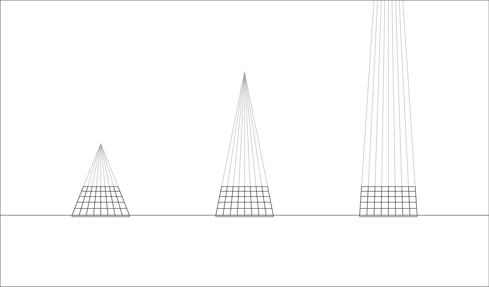

- All diagonals of the grids intersect at one point, called `distant point`, The further a distant point away from grids, the grid become fatter. In fact, there are 2 distant point, the following image draws the one to the left of vanish point.

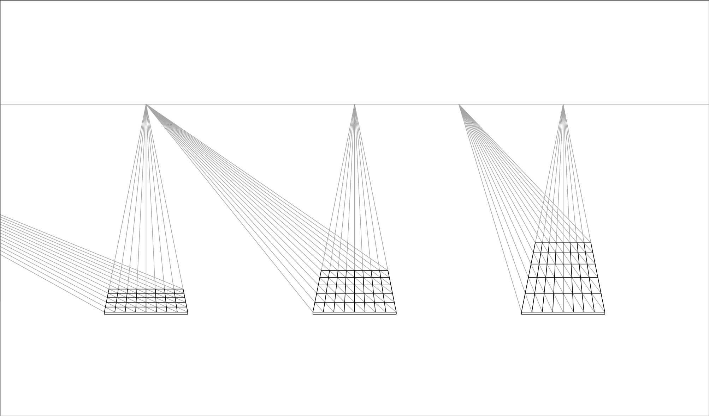

## Screenshot Pre-processing

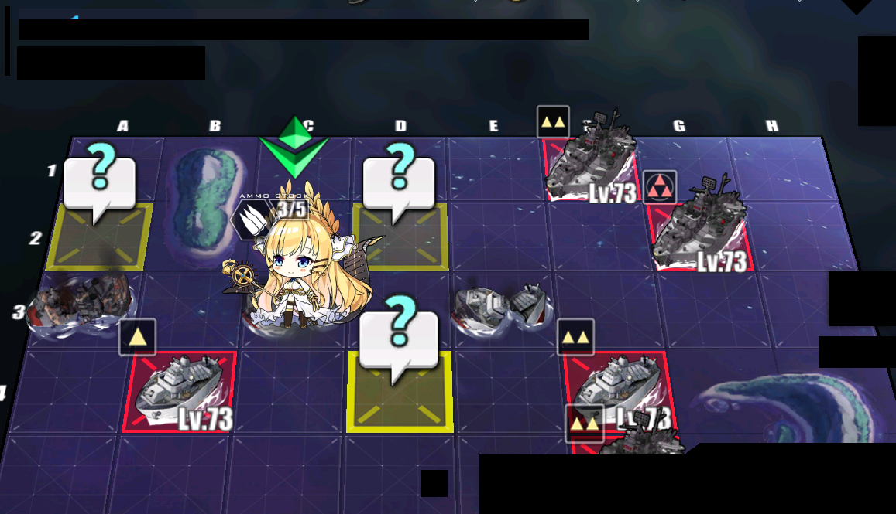

When perspective.py gets an screenshot, function  `load_image`  do such process:

- crop area of detection
- to grayscale, Using the algorithm in Photoshop, (MAX(R, G, B) + MIN(R, G, B)) // 2
- cover UI. Here use `overlay.png` 
- Reverse color

(Image above is before reverse, because the reversed image is too terrified to show)

## Grid Detection

### Detecting Grid Lines

Grid lines are black lines with a transparency of 20%. In 720P, it has 3 to 4 pixel wide. During the period of "old-UI", we simply move the image 1px and divide by the origin image to detect grid lines. White frame with transparency gradient is added in "new-UI", which increase the difficulty of detection.

Function `find_peaks` use  `scipy.signal.find_peaks` to find grid lines. `scipy.signal.find_peaks` can find peaks of given data.

Crop image at height == 370, use following parameters:

```
FIND_PEAKS_PARAMETERS = {
    'height': (150, 255 - 40),
    'width': 2,
    'prominence': 10,
    'distance': 35,
}
```

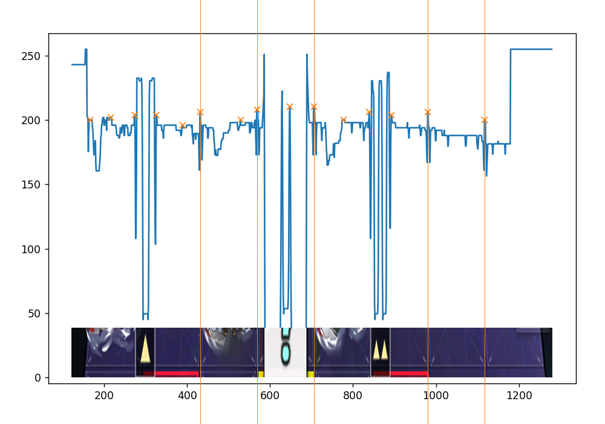

As you can see, some grid lines are not detected and has many mistake as well. Not a big deal.

Scan every row and draw the image. (For better performance, image will be flatten to 1-D array before detection, which will reduce time cost to 1/4.)

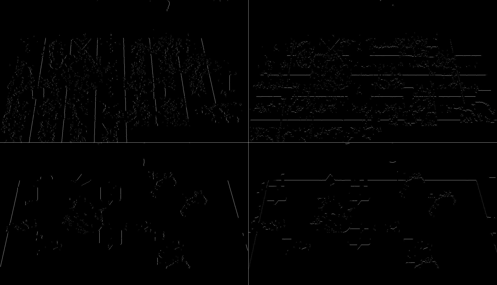

We gets 4 images so far, they are `vertical inner lines`, `horizontal inner lines`, `vertical edge lines`, `horizontal edge lines`. This process takes about 0.13 s on `I7-8700k` , and the full map detection process will take about 0.15 s.

P. S. Parameters use to detect inner lines are different from edge lines. In different maps, we should use different parameters. If you are lazy, you can use the default parameters, which is for 7-2. Those parameters can be used in Chapter 7, can even be used in `北境序曲(event_20200227_cn) D3`.

## Fitting Grid Lines

Function `hough_lines` use  `cv2.HoughLines` to detect lines. Now we have 4 group of lines.

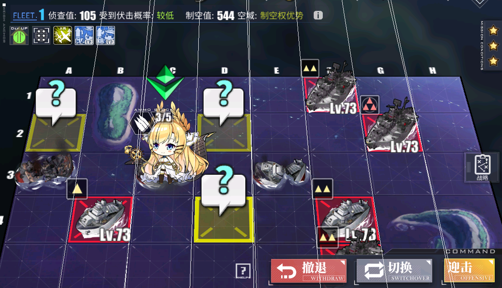

Take `vertical inner lines` for example. There some incorrect lines.

We create a horizontal line at the middle of image, called `MID_Y`, (When fixing vertical lines, create a vertical one), and cross  `vertical inner lines`, those crossing points are called `mid`. If the distance between two mids smaller than 3, we treat them as a group of lines, and replace them with their average. After that, we corrected the result.

## Fitting Vanish Point

As mention above, all vertical lines in one point perspective intersect at one point. There are errors in vertical lines, so we can't solve the equations to get that.

Function `_vanish_point_value` , use to calculate the distance between a point and a group of lines, and use `scipy.optimize.brute` to brute-force solve the closest point to vertical lines, which is called `vanish point`. This surface shows the sum of distance from the point to the group of vertical line. In order to ignore wrong lines far away from vanish point, it uses logarithm.

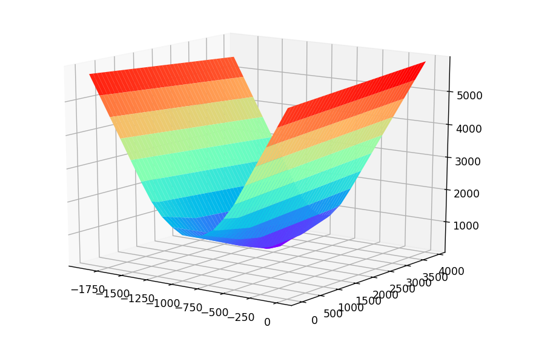

Still remember `mid` ? we re-link then to vanish point, and act as vertical lines. This is the 2nd correction.

## Fitting Distant Point

We intersect the corrected vertical lines and the origin horizontal lines. `distant point` and `canish point` are on the same horizontal line, so we take a point on this horizontal line, and link all intersection, get `oblique lines`. Function  `_distant_point_value` calculates the distance between the `mid` of oblique lines. Also use `scipy.optimize.brute` to brute-force solve the closet point, called `distant point`.

This image draws the oblique lines. Although there are many mistakes, it do gets the correct point.


## Cleansing Grid Lines

With the above process, we get grid lines like this. It's generally correct, but with mistakes.

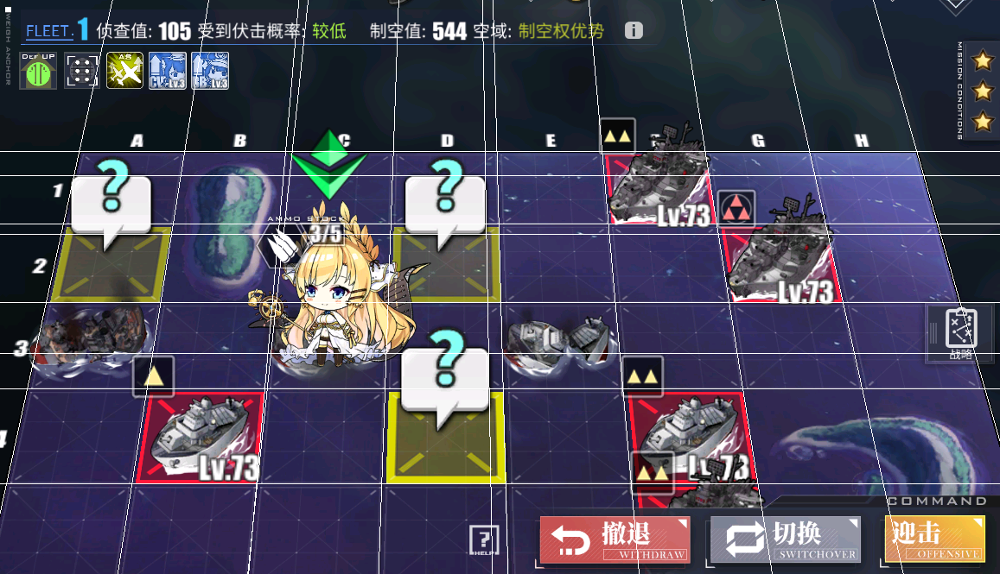

Take the `mid` of vertical lines.

```
[ 185.63733413  315.65944444  441.62998244  446.89313842  573.6301653
  686.40881027  701.20376316  830.27394123  959.00511191 1087.91874026
 1220.58809477]
```

We know all grid has a same width, so theoretically, `mid` is an arithmetic progression, but with wrong members and missing members. Use a linear function `y = a * x + b` to describe that. Because of mistakes and missing, the `x` in linear function may not be the number `n` in arithmetic progression. As long as mistakes less than 10, there will have  `x ∈ [n - 10, n + 10]` .

Then, transform the linear function as `b = -x * a + y`, and  `x ∈ [n - 10, n + 10]` . If treat `a` to be independent variable and treat `b` to be dependent variable, it's a group of lines with amount of 11 * 21. Draw them.

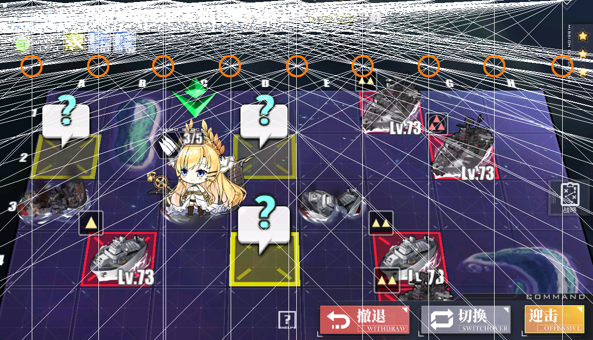

Discover that many lines intersect at where the orange circle pointed out, we call them `coincident point`. Those incorrect `mid` from incorrect lines can't intersect there, and get deleted.

Use  `scipy.optimize.brute` to brute-force solve the coordinate of the best `coincident point`.

```
[-201.33197146  129.0958336]
```

So the linear function is `y = 129.0958336 * x - 201.33197146` .

> When calculating distance to the lines, it uses this function
>
> ```
> distance = 1 / (1 + np.exp(9 / distance) / distance)
> ```
> This function makes it less effect by lines far away, encourage optimizer to choose the local minimum.
>
> 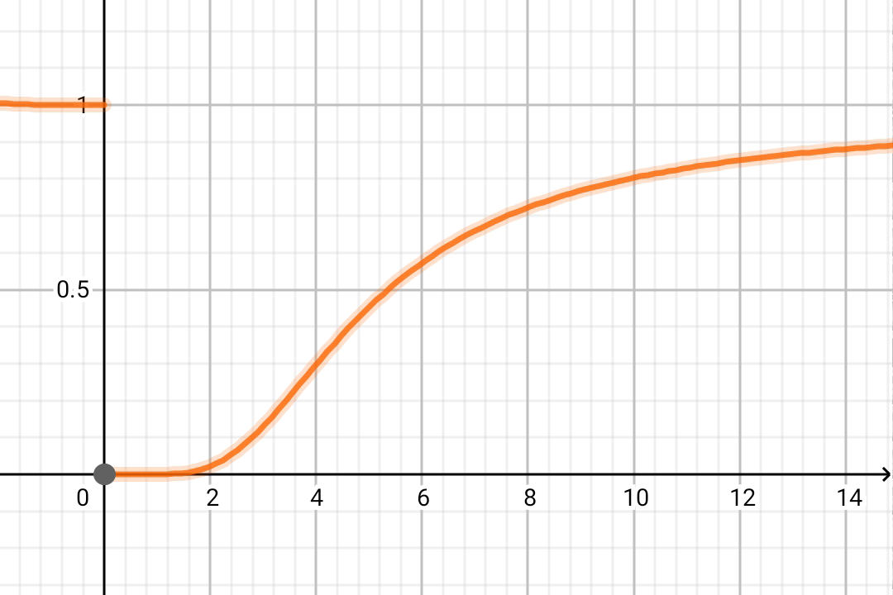

>How to cleanse horizontal lines?
>
>Make any line through `distant point`, link intersections and  `vanish point` . This finish a map relation from horizontal lines to vertical lines. When cleanse finished, do a reversed process.
>
>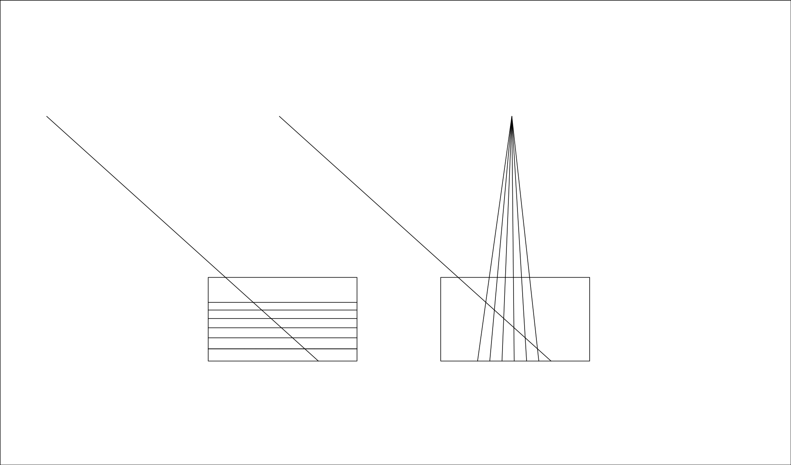

At last, generate `mid`, and crop it with the edge of map and screen. Missing `mid` get filled now. Re-link `mid` to vanish point, and the cleansing of grid lines is finished.

Draw results:


# Grid Cropping

In fact, shipgrils, enemies, mystery are images fixed on grid center. They are scaled because of perspective.

P. S. They are scaled only, but not perspective transform. Only red border and yellow border on the ground are perspective transformed.

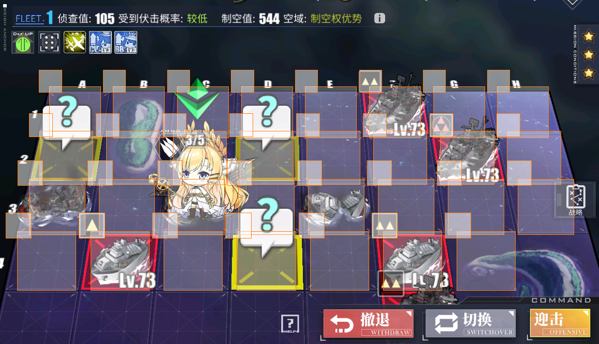

In `grid_predictor.py`, provides function  `get_relative_image` , which do crops according to grid center, and rescale to given shape. Now we can simply use template matching.

```
from PIL import Image
from module.config.config import cfg
i = Image.open(file)
grids = Grids(i, cfg)
out = Image.new('RGB', tuple((grids.shape + 1) * 105 - 5))
for loca, grid in grids.grids.items():
    image = grid.get_relative_image(
    	(-0.415 - 0.7, -0.62 - 0.7, -0.415, -0.62), output_shape=(100, 100))
    out.paste(image, tuple(np.array(loca) * 105))
out
```

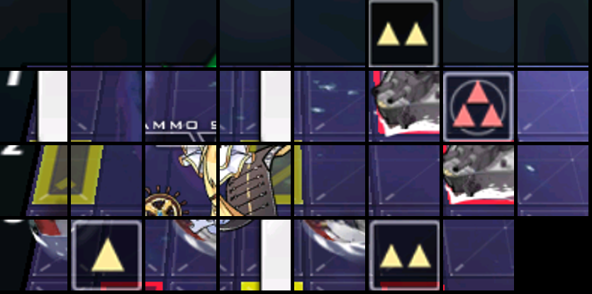

## Parsing Grid Data

To be continued.

