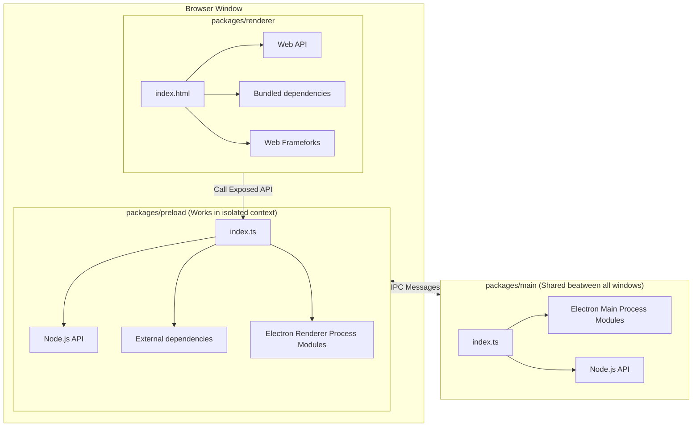
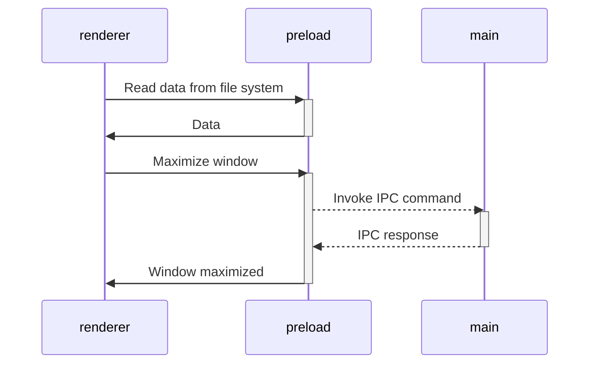

<<<<<<< HEAD
# Vite Electron Builder Boilerplate

This is a template for secure electron applications. Written following the latest safety requirements, recommendations
and best practices.

Under the hood is [Vite] — A next-generation blazing fast bundler, and [electron-builder] for packaging.

## Get started

Follow these steps to get started with the template:

1. Click the **[Use this template](https://github.com/cawa-93/vite-electron-builder/generate)** button (you must be
   logged in) or just clone this repo.
2. If you want to use another package manager you may need to edit [`.github/workflows`](/.github/workflows) — [it
   uses `npm` by default](https://github.com/search?q=npm+repo%3Acawa-93%2Fvite-electron-builder+path%3A.github%2Fworkflows&type=Code&ref=advsearch&l=&l=).
3. If you like this template, don't forget to give a github star or send support! ⭐♥

That's all you need. 😉

> **Note**:
> This template uses npm v7 feature — [**Installing Peer Dependencies
Automatically**](https://github.com/npm/rfcs/blob/latest/implemented/0025-install-peer-deps.md). If you are using a
different package manager, you may need to install some peerDependencies manually.
=======
# Vite Electron Builder Boilerplate v2

[](https://github.com/cawa-93/vite-electron-builder/issues?q=label%3A%22help+wanted%22+is%3Aopen+is%3Aissue)
[](https://nodejs.org/about/releases/)
[](https://github.com/npm/cli/releases)

> Vite+Electron = 🔥

This is a secure template for electron applications. Written following the latest safety requirements, recommendations and best practices.

Under the hood is used [Vite] — super fast, nextgen bundler, and [electron-builder] for compilation.


___
### Support
- This template maintained by [Alex Kozack][cawa-93-github]. You can [💖 sponsor him][cawa-93-sponsor] for continued development of this template.

- Found a problem? Pull requests are welcome.

- If you have ideas, questions or suggestions - **Welcome to [discussions](https://github.com/cawa-93/vite-electron-builder/discussions)**. 😊
___


## Get started

Follow these steps to get started with this template:

1. Click the **[Use this template](https://github.com/cawa-93/vite-electron-builder/generate)** button (you must be logged in) or just clone this repo.
2. If you want use another package manager don't forget edit [`.github/workflows`](/.github/workflows) -- it uses `npm` by default.

That's all you need. 😉

**Note**: This template uses npm v7 feature — [**Installing Peer Dependencies Automatically**](https://github.com/npm/rfcs/blob/latest/implemented/0025-install-peer-deps.md). If you are using a different package manager, you may need to install some peerDependencies manually.


>>>>>>> 24aa3e00bd9af9a6a050df54c6a0cef959a9c6c0

## Features

### Electron [][electron]
<<<<<<< HEAD

- This template uses the latest electron version with all the latest security patches.
- The architecture of the application is built according to the
  security [guides](https://www.electronjs.org/docs/tutorial/security) and best practices.
- The latest version of the [electron-builder] is used to package the application.

### Vite [][vite]

- [Vite] is used to bundle all source codes. It's an extremely fast bundler, that has a vast array of amazing features.
  You can learn more about how it is arranged in [this](https://www.youtube.com/watch?v=xXrhg26VCSc) video.
- Vite [supports](https://vitejs.dev/guide/env-and-mode.html) reading `.env` files. You can also specify the types of
  your environment variables in [`types/env.d.ts`](types/env.d.ts).
- Automatic hot-reloads for the `Main` and `Renderer` processes.

Vite provides many useful features, such as: `TypeScript`, `TSX/JSX`, `CSS/JSON Importing`, `CSS Modules`
, `Web Assembly` and much more.

> [See all Vite features](https://vitejs.dev/guide/features.html).

### TypeScript [][typescript] (optional)

- The latest version of TypeScript is used for all the source code.
- **Vite** supports TypeScript out of the box. However, it does not support type checking.
- Code formatting rules follow the latest TypeScript recommendations and best practices thanks
  to [@typescript-eslint/eslint-plugin](https://www.npmjs.com/package/@typescript-eslint/eslint-plugin).

> [Guide to disable typescript and remove dependencies](https://github.com/cawa-93/vite-electron-builder/discussions/339) 

### Vue [][vue] (optional)

- By default, web pages are built using [Vue]. However, you can easily change that. Or not use additional frameworks at
  all.
- Code formatting rules follow the latest Vue recommendations and best practices thanks to [eslint-plugin-vue].

> [Find more forks 🔱 for others frameworks or setups](https://github.com/cawa-93/vite-electron-builder/discussions/categories/forks)

### Continuous Integration

- The configured workflow will check the types for each push and PR.
- The configured workflow will check the code style for each push and PR.
- **Automatic tests**
  used [Vitest ][vitest]
  -- A blazing fast test framework powered by Vite.
  - Unit tests are placed within each package and are ran separately.
  - End-to-end tests are placed in the root [`tests`](tests) directory and use [playwright].


### Publishing

- Each time you push changes to the `main` branch, the [`release`](.github/workflows/release.yml) workflow starts, which creates a new draft release. For each next commit will be created and replaced artifacts. That way you will always have draft with latest artifacts, and the release can be published once it is ready. 
  - Code signing supported. See [`release` workflow](.github/workflows/release.yml).
  - **Auto-update is supported**. After the release is published, all client applications will download the new version
  and install updates silently.
  
> **Note**:
> This template **configured only for GitHub public repository**, but electron-builder also supports other update distribution servers. Find more in [electron-builder docs](https://www.electron.build/configuration/publish).

## How it works

The template requires a minimum amount [dependencies](package.json). Only **Vite** is used for building, nothing more.

### Project Structure

The structure of this template is very similar to a monorepo. The entire source code of the project is divided into three modules (packages) that are each bundled independently:

- [`packages/renderer`](packages/renderer). Responsible for the contents of the application window. In fact, it is a
  regular web application. In developer mode, you can even open it in a browser. The development and build process is
  the same as for classic web applications. Access to low-level API electrons or Node.js is done through the _preload_
  layer.
- [`packages/preload`](packages/preload). Contain Electron [**preload scripts**](https://www.electronjs.org/docs/latest/tutorial/tutorial-preload). Acts as an intermediate bridge between the _renderer_ process and the API
  exposed by electron and Node.js. Runs in an _isolated browser context_, but has direct access to the full Node.js
  functionality.
- [`packages/main`](packages/main)
  Contain Electron [**main script**](https://www.electronjs.org/docs/tutorial/quick-start#create-the-main-script-file). This is
  the main process that powers the application. It manages creating and handling the spawned BrowserWindow, setting and
  enforcing secure permissions and request handlers. You can also configure it to do much more as per your need, such
  as: logging, reporting statistics and health status among others.

Schematically, the structure of the application and the method of communication between packages can be depicted as follows:

### Build web resources

The `main` and `preload` packages are built in [library mode](https://vitejs.dev/guide/build.html#library-mode) as it is
simple javascript.
The `renderer` package builds as a regular web app.

### Compile App

The next step is to package a ready to distribute Electron app for macOS, Windows and Linux with "auto update" support
out of the box.

To do this, use [electron-builder]:

- Using the npm script `compile`: This script is configured to compile the application as quickly as possible. It is not
  ready for distribution, it is compiled only for the current platform and is used for debugging.
- Using GitHub Actions: The application is compiled for any platform and ready-to-distribute files are automatically
  added as a draft to the GitHub releases page.

### Working with dependencies

Because the `renderer` works and builds like a _regular web application_, you can only use dependencies that support the
browser or compile to a browser-friendly format.

This means that in the `renderer` you are free to use any frontend dependencies such as Vue, React, lodash, axios and so
on. However, you _CANNOT_ use any native Node.js APIs, such as, `systeminformation`. These APIs are _only_ available in
a Node.js runtime environment and will cause your application to crash if used in the `renderer` layer. Instead, if you
need access to Node.js runtime APIs in your frontend, export a function form the `preload` package.

All dependencies that require Node.js api can be used in
the [`preload` script](https://www.electronjs.org/docs/latest/tutorial/process-model#preload-scripts).

#### Expose in main world
Here is an example. Let's say you need to read some data from the file system or database in the renderer.

In the preload context, create a function that reads and returns data. To make the function announced in the preload
available in the render, you usually need to call
the [`electron.contextBridge.exposeInMainWorld`](https://www.electronjs.org/ru/docs/latest/api/context-bridge). However,
this template uses the [unplugin-auto-expose](https://github.com/cawa-93/unplugin-auto-expose) plugin, so you just need
to export the method from the preload. The `exposeInMainWorld` will be called automatically.

```ts
// preload/index.ts
import { readFile } from 'node:fs/promises';

// Encapsulate types if you use typescript
interface UserData {
  prop: string
}

// Encapsulate all node.js api
// Everything you exported from preload/index.ts may be called in renderer
export function getUserData(): Promise<UserData> {
  return readFile('/path/to/file/in/user/filesystem.json', {encoding:'utf8'}).then(JSON.parse);
}
```

Now you can import and call the method in renderer

```ts
// renderer/anywere/component.ts
import { getUserData } from '#preload'
const userData = await getUserData()
```

> Find more in [Context Isolation tutorial](https://www.electronjs.org/docs/tutorial/context-isolation#security-considerations).

### Working with Electron API

Although the preload has access to all of Node.js's API, it **still runs in the BrowserWindow context**, so a limited
electron modules are available in it. Check the [electron docs](https://www.electronjs.org/ru/docs/latest/api/clipboard)
for full list of available methods.

All other electron methods can be invoked in the `main`.

As a result, the architecture of interaction between all modules is as follows:



> Find more in [Inter-Process Communication tutorial](https://www.electronjs.org/docs/latest/tutorial/ipc).

### Modes and Environment Variables

All environment variables are set as part of the `import.meta`, so you can access them vie the following
way: `import.meta.env`.

> **Note**:
> If you are using TypeScript and want to get code completion you must add all the environment variables to
the [`ImportMetaEnv` in `types/env.d.ts`](types/env.d.ts).

The mode option is used to specify the value of `import.meta.env.MODE` and the corresponding environment variables files
that need to be loaded.

By default, there are two modes:

- `production` is used by default
- `development` is used by `npm run watch` script

When running the build script, the environment variables are loaded from the following files in your project root:
=======
- Template use the latest electron version with all the latest security patches.
- The architecture of the application is built according to the security [guids](https://www.electronjs.org/docs/tutorial/security) and best practices.
- The latest version of the [electron-builder] is used to compile the application.


### Vite [][vite]
- [Vite] is used to bundle all source codes. This is an extremely fast packer that has a bunch of great features. You can learn more about how it is arranged in [this](https://youtu.be/xXrhg26VCSc) video.
- Vite [supports](https://vitejs.dev/guide/env-and-mode.html) reading `.env` files. You can also specify types of your environment variables in [`types/vite-env.d.ts`](types/vite-env.d.ts).

Vite provides you with many useful features, such as: `TypeScript`, `TSX/JSX`, `CSS/JSON Importing`, `CSS Modules`, `Web Assembly` and much more.

[See all Vite features](https://vitejs.dev/guide/features.html).


### TypeScript [][typescript] (optional)
- The Latest TypeScript is used for all source code. 
- **Vite** supports TypeScript out of the box. However, it does not support type checking.
- Code formatting rules follow the latest TypeScript recommendations and best practices thanks to [@typescript-eslint/eslint-plugin](https://www.npmjs.com/package/@typescript-eslint/eslint-plugin).

**[See this discussion](https://github.com/cawa-93/vite-electron-builder/discussions/339)** if you want completly remove TypeScript. 


### Vue [][vue] (optional)
- By default, web pages are built using [Vue]. However, you can easily change it. Or do not use additional frameworks at all. (See [React fork](https://github.com/soulsam480/vite-electron-react-starter))
- Also, by default, the [vue-router] version [][vue-router] is used.
- Code formatting rules follow the latest Vue recommendations and best practices thanks to [eslint-plugin-vue].
- Installed [Vue.js devtools beta](https://chrome.google.com/webstore/detail/vuejs-devtools/ljjemllljcmogpfapbkkighbhhppjdbg) with Vue 3 support.

See [examples of web pages for different frameworks](https://github.com/vitejs/vite/tree/main/packages/create-vite).

### Continuous Integration
- The configured workflow for check the types for each push and PR.
- The configured workflow for check the code style for each push and PR.
- **Automatic tests** used [playwright]. Simple, automated test check:
  - Does the main window created and visible?
  - Is the main window not empty?
  - Is dev tools closed?
  - Is preload script loaded?
  

### Continuous delivery
- Each time you push changes to the `main` branch, [`release`](.github/workflows/release.yml) workflow starts, which creates release draft.
  - The version is automatically set based on the current date in the format `yy.mm.dd-minutes`.
  - Notes are automatically generated and added to the release draft.
  - Code signing supported. See [`compile` job in `release` workflow](.github/workflows/release.yml).
- **Auto-update is supported**. After the release will be published, all client applications will download the new version and install updates silently.


## Status

This template was created to make my work easier. It may not be universal, but I try to keep it that way.

I am actively involved in its development. But I do not guarantee that this template will be maintained in the future.


**At the moment, there are the following problems:**

- ⚠ Playwright has **experimental** support for Electron.
- ⚠ Release notes are created automatically based on commit history. [`.github/actions/release-notes`](.github/actions/release-notes) is used for generation. It may not provide some scenarios. If you encounter a problem - write about it.
- ⏳ I want to migrate all code base to ESM. But because Nodejs  ecosystem is unprepared I have not known whether this will give more benefits or more inconvenience.

Some improvement or problems can be listed in [issues](https://github.com/cawa-93/vite-electron-builder/issues).

**Pull requests are welcome**.

## How it works
The template required a minimum [dependencies](package.json). Only **Vite** is used for building, nothing more.

### Project Structure

The structure of this template is very similar to the structure of a monorepo.

The entire source code of the program is divided into three modules (packages) that are bundled each independently:
- [`packages/main`](packages/main)
Electron [**main script**](https://www.electronjs.org/docs/tutorial/quick-start#create-the-main-script-file).
- [`packages/preload`](packages/preload)
Used in `BrowserWindow.webPreferences.preload`. See [Checklist: Security Recommendations](https://www.electronjs.org/docs/tutorial/security#2-do-not-enable-nodejs-integration-for-remote-content).
- [`packages/renderer`](packages/renderer)
Electron [**web page**](https://www.electronjs.org/docs/tutorial/quick-start#create-a-web-page).

### Build web resources

Packages `main` and `preload` are built in [library mode](https://vitejs.dev/guide/build.html#library-mode) as it is a simple javascript.
`renderer` package build as regular web app.

The build of web resources is performed in the [`scripts/build.js`](scripts/build.js). Its analogue is a sequential call to `vite build` for each package.

### Compile App
Next step is run  packaging and compilation a ready for distribution Electron app for macOS, Windows and Linux with "auto update" support out of the box. 

To do this, using the [electron-builder]:
- In npm script `compile`: This script is configured to compile the application as quickly as possible. It is not ready for distribution, is compiled only for the current platform and is used for debugging.
- In GitHub Action: The application is compiled for any platform and ready-to-distribute files are automatically added to the draft GitHub release. 


### Using Node.js API in renderer
According to [Electron's security guidelines](https://www.electronjs.org/docs/tutorial/security#2-do-not-enable-nodejs-integration-for-remote-content), Node.js integration is disabled for remote content. This means that **you cannot call any Node.js api in the `packages/renderer` directly**. To do this, you **must** describe the interface in the `packages/preload` where Node.js api is allowed:
```ts
// packages/preload/src/index.ts
import {readFile} from 'fs/promises'

const api = {
  readConfig: () =>  readFile('/path/to/config.json', {encoding: 'utf-8'}),
}

contextBridge.exposeInMainWorld('electron', api)
```

```ts
// packages/renderer/src/App.vue
import {useElectron} from '/@/use/electron'

const {readConfig} = useElectron()
```

[Read more about Security Considerations](https://www.electronjs.org/docs/tutorial/context-isolation#security-considerations).


### Modes and Environment Variables
All environment variables set as part of the `import.meta`, so you can access them as follows: `import.meta.env`. 

You can also specify types of your environment variables in [`types/vite-env.d.ts`](types/vite-env.d.ts).

The mode option is used to specify the value of `import.meta.env.MODE` and the corresponding environment variables files that needs to be loaded.

By default, there are two modes:
  - `production` is used by default
  - `development` is used by `npm run watch` script

When running building, environment variables are loaded from the following files in your project root:
>>>>>>> 24aa3e00bd9af9a6a050df54c6a0cef959a9c6c0

```
.env                # loaded in all cases
.env.local          # loaded in all cases, ignored by git
.env.[mode]         # only loaded in specified env mode
.env.[mode].local   # only loaded in specified env mode, ignored by git
```

<<<<<<< HEAD
> **Warning**: 
> To prevent accidentally leaking env variables to the client, only variables prefixed with `VITE_` are exposed to your
Vite-processed code.

For example let's take the following `.env` file:

```
DB_PASSWORD=foobar
VITE_SOME_KEY=123
```

Only `VITE_SOME_KEY` will be exposed as `import.meta.env.VITE_SOME_KEY` to your client source code, but `DB_PASSWORD`
will not.

You can change that prefix or add another. See [`envPrefix`](https://vitejs.dev/config/shared-options.html#envprefix)
=======
**Note:** only variables prefixed with `VITE_` are exposed to your code (e.g. `VITE_SOME_KEY=123`) and `SOME_KEY=123` will not. You can access `VITE_SOME_KEY` using `import.meta.env.VITE_SOME_KEY`. This is because the `.env` files may be used by some users for server-side or build scripts and may contain sensitive information that should not be exposed in code shipped to browsers.


>>>>>>> 24aa3e00bd9af9a6a050df54c6a0cef959a9c6c0

## Contribution

See [Contributing Guide](contributing.md).


[vite]: https://github.com/vitejs/vite/
<<<<<<< HEAD

[electron]: https://github.com/electron/electron

[electron-builder]: https://github.com/electron-userland/electron-builder

[vue]: https://github.com/vuejs/vue-next

[vue-router]: https://github.com/vuejs/vue-router-next/

[typescript]: https://github.com/microsoft/TypeScript/

[playwright]: https://playwright.dev

[vitest]: https://vitest.dev

[vue-tsc]: https://github.com/johnsoncodehk/vue-tsc

[eslint-plugin-vue]: https://github.com/vuejs/eslint-plugin-vue

[cawa-93-github]: https://github.com/cawa-93/

=======
[electron]: https://github.com/electron/electron
[electron-builder]: https://github.com/electron-userland/electron-builder
[vue]: https://github.com/vuejs/vue-next
[vue-router]: https://github.com/vuejs/vue-router-next/
[typescript]: https://github.com/microsoft/TypeScript/
[playwright]: https://playwright.dev
[vue-tsc]: https://github.com/johnsoncodehk/vue-tsc
[eslint-plugin-vue]: https://github.com/vuejs/eslint-plugin-vue
[cawa-93-github]: https://github.com/cawa-93/
>>>>>>> 24aa3e00bd9af9a6a050df54c6a0cef959a9c6c0
[cawa-93-sponsor]: https://www.patreon.com/Kozack/
